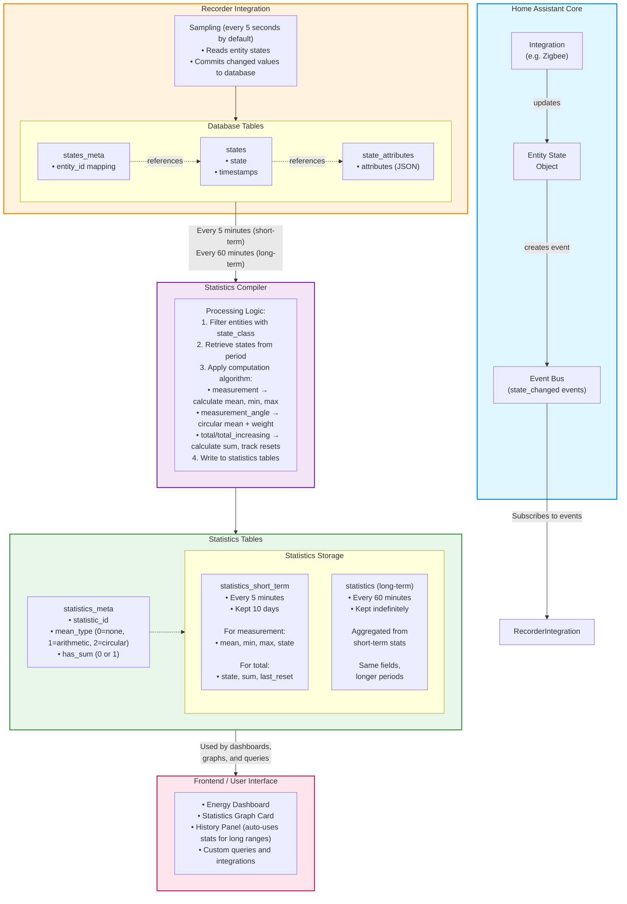

# Understanding and Using Home Assistant Statistics

- [Understanding and Using Home Assistant Statistics](#understanding-and-using-home-assistant-statistics)
  - [Overview](#overview)
  - [Part 1: Foundational Concepts](#part-1-foundational-concepts)
    - [1.1 Simplified Home Assistant Core Behavior](#11-simplified-home-assistant-core-behavior)
    - [1.2 The Recorder Integration](#12-the-recorder-integration)
    - [1.3 The States Table](#13-the-states-table)
  - [Part 2: Statistics Generation](#part-2-statistics-generation)
    - [2.1 What Are Statistics?](#21-what-are-statistics)
    - [2.2 Which Entities Generate Statistics?](#22-which-entities-generate-statistics)
    - [2.3 Statistics Generation Process](#23-statistics-generation-process)
    - [2.4 Statistics Computation Process](#24-statistics-computation-process)
    - [2.5 The Recorder Data Flow Diagram](#25-the-recorder-data-flow-diagram)
    - [2.6 The Statistics Tables](#26-the-statistics-tables)
    - [2.7 Short and long term Statistics tracking examples](#27-short-and-long-term-statistics-tracking-examples)
  - [Part 3: Working with Statistics](#part-3-working-with-statistics)
    - [3.1 Benefits of Statistics](#31-benefits-of-statistics)
    - [3.2 Accessing Statistics](#32-accessing-statistics)
    - [3.3 Common Use Cases](#33-common-use-cases)
  - [Part 4: Best Practices and Troubleshooting](#part-4-best-practices-and-troubleshooting)
    - [4.1 State Class Selection Guide](#41-state-class-selection-guide)
    - [Troubleshooting Decision Tree](#troubleshooting-decision-tree)
    - [4.2 Configuration Recommendations](#42-configuration-recommendations)
    - [4.3 Statistics Limitations](#43-statistics-limitations)
    - [4.4 Troubleshooting](#44-troubleshooting)
  - [Conclusion](#conclusion)
    - [Key Takeaways](#key-takeaways)
  - [References](#references)
    - [Home Assistant Documentation](#home-assistant-documentation)
    - [Home Assistant Developer Docs](#home-assistant-developer-docs)
    - [Home Assistant Data Science Portal](#home-assistant-data-science-portal)
    - [Community Resources](#community-resources)

## Overview

This document explains how statistics are generated in Home Assistant (HA) and how to work with them effectively. Statistics provide aggregated, long-term data storage that is more efficient than raw state history, making them essential for tracking trends, creating dashboards, and analyzing system behavior over time.

Before diving into statistics themselves, we'll explore how HA Core and the Recorder integration work, as these form the foundation for statistics generation.

---

## Part 1: Foundational Concepts

### 1.1 Simplified Home Assistant Core Behavior

Home Assistant Core is an **event-driven application** that maintains real-time state for all entities in your system. Understanding this architecture is crucial to understanding how statistics are derived.

#### Key Concepts

#### Entities and States

Entities are the basic building blocks to hold data in Home Assistant. An entity represents a sensor, actor, or function in Home Assistant. Entities are used to monitor physical properties or to control other entities. An entity is usually part of a device or a service. Entities constantly keep track of their state and associated attributes. For example:

- Entity: `light.kitchen`
- State: `on`
- Attributes: color, brightness, etc.

#### Events

Everything that happens in HA is represented as an event:

- A light being turned on
- A motion sensor being triggered
- An automation executing
- A state change occurring

Note that all entities produce state change events. Every time a state changes, a state change event is produced. State change events are just one type of event on the event bus, but there are other kinds of events, such as the [built-in events](https://www.home-assistant.io/docs/configuration/events/#built-in-events-core) that are used to coordinate between various integrations.

#### State Update Frequency

The frequency of state updates varies by integration:

- **Polling integrations**: Update at regular intervals (e.g., every 30 seconds for a temperature sensor)
- **Push-based integrations**: Update when the device reports a change (e.g., a ZigBee temperature sensor waking from sleep)
- **Event-based integrations**: Update immediately when triggered (e.g., a button press)

#### Stateless Operation

HA Core can run without persistent history. In this mode, you always know the current state of your system, but not how you arrived there. The Recorder integration provides this historical context.

> **Further Reading**: For more details, see the [Core Architecture](https://developers.home-assistant.io/docs/architecture_index) and [Entity Integration](https://developers.home-assistant.io/docs/architecture_index) documentation.

---

### 1.2 The Recorder Integration

The Recorder integration stores historical data about your system in a database, enabling you to track how states change over time.

#### How Recording Works

##### Sampling and Storage

- Objects are **sampled every 5 seconds** by default (configurable)
- Values are **committed to the database only if they have changed**
- This 5-second interval is a balance between responsiveness and storage efficiency. According to the Nyquist-Shannon sampling theorem, a 5-second sampling rate means no events are lost if they occur at intervals of **10 seconds or longer**. This covers the vast majority of entity updates while preventing database saturation during event bursts.

##### Database Backend

- **Default**: SQLite (suitable for most installations)
- **Alternatives**: PostgreSQL, MySQL/MariaDB (for advanced setups with high write volumes)

> **Further Reading**: See the [Database Schema documentation](https://www.home-assistant.io/docs/backend/database/#schema) for complete table descriptions.

---

### 1.3 The States Table

The Recorder Integration writes to numerous tables in the database, but in the context of this document, the table we are interested in is the `states` table that is the primary storage location for entity state history. Understanding its structure is essential for working with raw data and statistics.

#### Table Schema

#### Used Fields

We only show the fields that are in use at the time of this writing. Other fields in the table are deprecated and should be ignored.

| Field                   | Type         | Description                                                                           |
| ------------------------- | -------------- | --------------------------------------------------------------------------------------- |
| `state_id`              | INTEGER      | Primary key, auto-incrementing unique identifier for each state record                |
| `metadata_id`           | INTEGER      | Foreign key to`states_meta` table (contains `entity_id` mapping)                      |
| `state`                 | VARCHAR(255) | The actual state value (e.g., "234.0", "on", "off", "23.5°C")                        |
| `last_updated_ts`       | FLOAT        | Unix timestamp when state was last updated (even if only attributes changed)          |
| `last_changed_ts`       | FLOAT        | Unix timestamp when the actual state value changed (NULL if same as`last_updated_ts`) |
| `last_reported_ts`      | FLOAT        | Unix timestamp when the state was last reported by the integration                    |
| `old_state_id`          | INTEGER      | Links to the previous`state_id` for this entity (enables state history traversal)     |
| `attributes_id`         | INTEGER      | Foreign key to`state_attributes` table (stored separately to avoid duplication)       |
| `context_id_bin`        | BLOB(16)     | Binary UUID identifying the context that caused this state change                     |
| `context_user_id_bin`   | BLOB(16)     | Binary UUID of the user who initiated the change (if applicable)                      |
| `context_parent_id_bin` | BLOB(16)     | Binary UUID of the parent context (for automation chains)                             |
| `origin_idx`            | SMALLINT     | Index indicating the origin of the state change                                       |

#### Important Distinctions

- **`last_updated_ts`**: Changes when state OR attributes change
- **`last_changed_ts`**: Changes only when the state value itself changes. The `last_changed_ts` field is stored as NULL when it equals `last_updated_ts` to save database space
- **`last_reported_ts`**: The timestamp from the integration/device

#### State Tracking for Statistics

The `states` table tracks all entity state changes, but in this document we focus specifically on "**statistical entities**" - those that generate **long-term statistics**. These entities belong to two main categories: the **measurement** type and the **total/counter** type (we'll explore these in detail in Part 2).

Let's examine how state tracking works with practical examples.

##### Example 1: Tracking Instantaneous Power Consumption (measurement type)

Consider an integration that polls the instantaneous power consumption of a house every minute (a "measurement" type sensor). We can query the state history using:

```sql
SELECT 
    sm.entity_id,
    s.state,
    datetime(s.last_updated_ts, 'unixepoch', 'localtime') as last_updated,
    datetime(COALESCE(s.last_changed_ts, s.last_updated_ts), 'unixepoch', 'localtime') as last_changed,
    datetime(s.last_reported_ts, 'unixepoch', 'localtime') as last_reported
FROM states s
INNER JOIN states_meta sm ON s.metadata_id = sm.metadata_id
WHERE sm.entity_id = 'sensor.linky_sinsts' 
AND s.last_updated_ts BETWEEN 
    strftime('%s', '2026-01-27 13:00:00') 
    AND strftime('%s', '2026-01-27 14:00:00')
ORDER BY s.last_updated_ts;
```

Results

| entity_id           | state | last_updated    | last_changed    | last_reported   |
| --------------------- | ------- | ----------------- | ----------------- | ----------------- |
| sensor.linky_sinsts | 2040  | 1/27/2026 13:00 | 1/27/2026 13:00 | 1/27/2026 13:00 |
| sensor.linky_sinsts | 2030  | 1/27/2026 13:01 | 1/27/2026 13:01 | 1/27/2026 13:01 |
| sensor.linky_sinsts | 2023  | 1/27/2026 13:02 | 1/27/2026 13:02 | 1/27/2026 13:02 |
| ...                 | ...   | ...             | ...             | ...             |

Here we can see that we have a new state entry every minute (set by the integration).

##### Example 2: ZigBee Temperature Sensor (measurement type)

In contrast, a ZigBee temperature sensor reports values at intervals determined by the device itself, which may be irregular:

| entity_id                 | state | last_updated  | last_changed  | last_reported |
| --------------------------- | ------- | --------------- | --------------- | --------------- |
| sensor.family_temperature | 13.59 | 1/27/26 12:00 | 1/27/26 12:00 | 1/27/26 12:00 |
| sensor.family_temperature | 13.63 | 1/27/26 12:01 | 1/27/26 12:01 | 1/27/26 12:01 |
| sensor.family_temperature | 13.6  | 1/27/26 12:38 | 1/27/26 12:38 | 1/27/26 12:38 |
| sensor.family_temperature | 13.64 | 1/27/26 12:51 | 1/27/26 12:51 | 1/27/26 12:51 |

##### Example 3: Energy Meter (Total/Counter Type)

The two entities presented above belong to the **measurement** type, where state values fluctuate up and down based on current conditions. We also have entities that belong to the **counter** type (e.g., energy consumption) where the state values are monotonically increasing:

| entity_id         | state    | last_updated    | last_changed    | last_reported   |
| ------------------- | ---------- | ----------------- | ----------------- | ----------------- |
| sensor.linky_east | 72199456 | 1/27/2026 12:59 | 1/27/2026 12:59 | 1/27/2026 12:59 |
| sensor.linky_east | 72199488 | 1/27/2026 13:00 | 1/27/2026 13:00 | 1/27/2026 13:00 |
| sensor.linky_east | 72199520 | 1/27/2026 13:01 | 1/27/2026 13:01 | 1/27/2026 13:01 |
| ...               | ...      | ...             | ...             | ...             |

---

## Part 2: Statistics Generation

### 2.1 What Are Statistics?

Home Assistant supports statistics, which are **aggregated and compressed representations** of entity data over time. Unlike the `states` table, which stores every state change, the statistics system stores information at regular intervals:

- **Short-term statistics**: Every 5 minutes (stored in `statistics_short_term` table)
- **Long-term statistics**: Every hour (stored in `statistics` table)

This dramatically reduces storage requirements while preserving trend data.

#### Short-term vs Long-term Statistics

| Aspect         | Short-term Statistics    | Long-term Statistics               |
| ---------------- | -------------------------- | ------------------------------------ |
| **Interval**   | 5 minutes                | 1 hour                             |
| **Retention**  | 10 days (auto-purged)    | Indefinite (or per purge settings) |
| **Table**      | `statistics_short_term`  | `statistics`                       |
| **Purpose**    | Recent detailed trends   | Historical trend analysis          |
| **Generation** | Direct from states table | Aggregated from short-term stats   |

### 2.2 Which Entities Generate Statistics?

Statistics are automatically generated for **entities** that meet certain criteria. While most statistical entities are in the `sensor` domain, ANY entity with an appropriate `state_class` can generate statistics, regardless of domain.

Statistical entities can be classified into two types: **measurement statistics** and **counter statistics**.

#### 2.2.1 Measurement Statistics (Representing a Measurement)

**Requirements:**

- `state_class` property must be set to `measurement` or `measurement_angle`
- The `device_class` must not be either of `date`, `enum`, `energy`, `gas`, `monetary`, `timestamp`, `volume` or `water`
- Must have a `unit_of_measurement` defined

**What is tracked:**
Home Assistant tracks the **min**, **max**, and **mean** values during each statistics period, updating them every 5 minutes.

**Important:** The `state` of "measurement statistics" represents a **real-time measurement at a point in time**, such as current temperature, humidity, or electrical power. Their state should represent a **current measurement**, not historical data, aggregations, or forecasts.

**Special case - Angular Measurements (`measurement_angle`):**
For sensors with `state_class: measurement_angle`, the state represents a real-time measurement for angles measured in degrees (°), such as current wind direction. These use **circular mean** calculations to correctly average angles.

#### 2.2.2 Counter Statistics (Representing a Total Amount)

**Requirements:**

- `state_class` property must be set to `total` or `total_increasing`
- May use the `last_reset` attribute
- Must have a `unit_of_measurement` defined

**What is tracked:**
Home Assistant tracks the **state**, **sum**, and **last_reset** values during each statistics period, updating them every 5 minutes.

**The sum field:**
The **sum** field tracks the cumulative growth/change over time:

- For counters that reset: sum tracks total consumption across resets
- For monotonically increasing counters: sum = current_value - initial_value
- State changes are converted to growth/consumption amounts

**The state fields:**
The state of "counter statistics" represents a total amount. Entities tracking a total amount have a value that may optionally reset periodically, such as:

- This month's energy consumption
- Today's energy production
- The weight of pellets used to heat the house over the last week

The sensor's value when the first statistics is compiled is used as the initial zero-point.

#### Counter Statistics Subtypes

##### 1. `state_class: total`

The state represents a total amount that can both **increase and decrease**, e.g., a net energy meter.

**About last_reset:**
`last_reset` indicates when the counter was reset to zero (e.g., start of a new billing period). When `last_reset` changes, the `state` must be a valid number.

##### 2. `state_class: total_increasing`

Similar to statistics with `state_class: total` with the restriction that the state represents a **monotonically increasing positive total** which periodically restarts counting from 0, e.g., a daily amount of consumed gas, weekly water consumption, or lifetime energy consumption.

### 2.3 Statistics Generation Process

Home Assistant provides support to process statistics through the following workflow:

1. **Entity state changes** are recorded in the `states` table
2. **Every 5 minutes**, the statistics compilation process writes to `statistics_short_term`
3. **Every 60 minutes**, short-term statistics are aggregated into `statistics`

#### Important Notes on Statistics Generation

- **No retroactive generation**: Statistics are only generated going forward from when `state_class` is first set
- **Historical states are not converted**: States recorded before `state_class` was added will not be converted to statistics
- **Missing data handling**: Gaps in state data create gaps in statistics

### 2.4 Statistics Computation Process

It's worth noting that the `statistics/statistics_short_term` tables are not entirely built from `states`. In practice, the statistics compiler pulls data from multiple recorder sources:

- **`states` / `states_meta`**: state changes
- **`state_attributes`**: needed because statistics often rely on the entity's `state_class`, `device_class`, `unit_of_measurement`, etc.
- **`statistics` itself**: Home Assistant can continue long-term statistics by using the previous statistics row as the starting point
- **(Sometimes) `events`**: some integrations rely on event history

> Statistics are computed from *recorded history*, which includes `states`, but may also require metadata/attributes and may chain from previously compiled statistics for continuity.

#### 2.4.1 Computation for Measurement Statistics

For entities with `state_class: measurement` or `measurement_angle`, Home Assistant calculates **min**, **max**, and **mean** values during each statistics period.

##### For `state_class: measurement` (Arithmetic Mean)

**Data Collection:**

- Every 5 seconds (by default), the Recorder samples the current entity state
- Only valid numeric states are considered (`unavailable` and `unknown` are excluded)
- Non-numeric values and unit changes are skipped

**Calculation Process (per 5-minute or 1-hour period):**

1. **Mean (Arithmetic Average)**:

   - Sum all valid numeric state values in the period
   - Divide by the number of valid samples
   - Formula: `mean = Σ(state_values) / n`
   - Example: States [2040, 2030, 2023] → mean = 2031
2. **Min (Minimum)**:

   - The lowest valid numeric value observed during the period
   - Example: States [2040, 2030, 2023] → min = 2023
3. **Max (Maximum)**:

   - The highest valid numeric value observed during the period
   - Example: States [2040, 2030, 2023] → max = 2040

**Storage:**

- In `statistics_meta`: `mean_type=1` (arithmetic), `has_sum=0`
- In `statistics`/`statistics_short_term`: `mean`, `min`, `max` are populated; `state`, `sum` and `last_reset_ts` are NULL

##### For `state_class: measurement_angle` (Circular Mean)

Angular measurements (like wind direction in degrees) require special handling because standard arithmetic averaging fails for angles. For example, the average of 350° and 10° should be 0° (North), not 180° (South).

**Circular Mean Calculation:**

1. Convert each angle θ to unit vectors:

   - x = cos(θ)
   - y = sin(θ)
2. Calculate average vector components:

   - mean_x = Σ(cos(θᵢ)) / n
   - mean_y = Σ(sin(θᵢ)) / n
3. Convert back to angle:

   - mean = atan2(mean_y, mean_x)
4. **Mean Weight**:

   - Stored as the length of the average vector: `sqrt(mean_x² + mean_y²)`
   - Values close to 1 indicate consistent direction
   - Values close to 0 indicate scattered directions

**Storage:**

- In `statistics_meta`: `mean_type=2` (circular), `has_sum=0`
- In `statistics`/`statistics_short_term`: `mean`, `min`, `max` and `mean_weight` are populated

#### 2.4.2 Computation for Counter Statistics

For entities with `state_class` set to `total` or `total_increasing`, Home Assistant tracks cumulative values using **state**, **sum**, and **last_reset**.

##### Understanding the Fields

**`state`**: The absolute meter/counter reading at the end of the period

- For energy meters: the total lifetime kWh reading
- Example: 72201200.0 kWh (absolute meter value)

**`sum`**: The cumulative growth/consumption since statistics began

- Represents total consumption from the statistics "zero point"
- When statistics first start, the initial state becomes the baseline
- sum = current_state - initial_state (when statistics began)

**`last_reset_ts`**: Timestamp when the counter was last reset (if applicable)

- Read from the entity's `last_reset` attribute
- NULL for lifetime counters that never reset

##### For `state_class: total_increasing` (Monotonically Increasing)

**Characteristics:**

- Counter only increases (or resets to zero/low value)
- Examples: Energy consumption, water usage, production counters

**Calculation Process:**

1. **State**: Last valid numeric value at end of period
2. **Sum Calculation**:

   - First statistics record: `sum = state - initial_state` (usually 0 or small value)
   - Subsequent records: `sum = previous_sum + (current_state - previous_state)`
   - If `current_state < (previous_state * 0.9)` (reset detected): treat as counter reset
     - Continue sum calculation: `sum = previous_sum + current_state` (assuming reset to 0)
   - Sum continuously accumulates, even across meter resets
3. **Last Reset**: Usually NULL unless entity provides `last_reset` attribute

**Note:** Home Assistant uses a **10% threshold** to detect resets rather than treating any small decrease as a reset. This prevents false reset detection from floating-point rounding errors or minor sensor glitches.

**Example:**

```text
13:00: state=72199616, sum=294296 (previous_sum + delta since 12:55)
13:05: state=72199768, sum=294448 (294296 + 152)
13:10: state=72199920, sum=294600 (294448 + 152)
...
14:00: state=72201200, sum=295880 (accumulated growth)
```

##### For `state_class: total` (Can Increase or Decrease)

**Characteristics:**

- Counter can increase OR decrease
- Examples: Net energy meter (with solar), battery charge level as counter

**Calculation Process:**

1. **State**: Last valid numeric value at end of period
2. **Sum Calculation**:

   - If `last_reset` hasn't changed: `sum = previous_sum + (current_state - previous_state)`
   - If `last_reset` changed: reset detected, restart accumulation
3. **Last Reset**:

   - Copied from entity's `last_reset` attribute
   - When this changes, sum calculation restarts

**Storage:**

- In `statistics_meta`: `mean_type=0` (none), `has_sum=1`
- In `statistics`/`statistics_short_term`: `state`, `sum`, and `last_reset_ts` are populated; `mean`, `min`, `max` are NULL

#### 2.4.3 Computing Delta/Growth from Statistics

While the statistics tables store cumulative `sum` values, dashboards and graphs often need to display **consumption or growth during a specific period**. This delta is computed from the `sum` field.

##### Formula

- Delta (consumption/growth) = sum_end - sum_start

Where:

- `sum_start` = sum value at the beginning of the desired period
- `sum_end` = sum value at the end of the desired period

##### Example: Hourly Energy Consumption

```sql
SELECT 
  sm.statistic_id,
  datetime(s.start_ts, 'unixepoch', 'localtime') as period_start,
  s.sum as cumulative_sum,
  s.sum - LAG(s.sum) OVER (ORDER BY s.start_ts) as period_consumption
FROM statistics s
INNER JOIN statistics_meta sm ON s.metadata_id = sm.id
WHERE sm.statistic_id = 'sensor.linky_east'
  AND datetime(s.start_ts, 'unixepoch', 'localtime') >= '2026-01-27 12:00:00'
  AND datetime(s.start_ts, 'unixepoch', 'localtime') < '2026-01-27 15:00:00'
ORDER BY s.start_ts;
```

Result:

| statistic_id      | period_start    | cumulative_sum | period_consumption |
| ------------------- | ----------------- | ---------------- | -------------------- |
| sensor.linky_east | 1/27/2026 12:00 | 294136         | NULL               |
| sensor.linky_east | 1/27/2026 13:00 | 295880         | 1744               |
| sensor.linky_east | 1/27/2026 14:00 | 297544         | 1664               |

**Interpretation:**

- Between 12:00-13:00: consumed 1744 Wh (1.74 kWh)
- Between 13:00-14:00: consumed 1664 Wh (1.66 kWh)

##### How Statistics Graph Card Uses This

The built-in statistics graph card:

1. Queries the relevant statistics rows for the time range
2. Calculates deltas: `consumption_in_period[i] = sum[i] - sum[i-1]`
3. Displays as bar chart (for consumption) or line chart (for cumulative)

This is why the `sum` field exists: to enable efficient delta calculations without reprocessing all raw states.

### 2.5 The Recorder Data Flow Diagram



#### Time Flow Example (Energy Meter)

```text
────────────────────────────────────────────────────────────────────────────
13:00:00  State: 72199488 ──┐
13:00:05  State: 72199490   ├─> Samples collected
13:00:10  State: 72199495   │   every 5 seconds
...                         │   (if changed)
13:04:55  State: 72199615   │
13:04:59  State: 72199616 ──┘
                            │
                13:05:00 ◄──┴── Statistics Compiler runs
                            │
                            └──> statistics_short_term:
                                 • start_ts: 13:00:00
                                 • state: 72199616
                                 • sum: 294296 (cumulative)
                                 • created_ts: 13:05:00

After 12 such 5-minute periods:
                            │
                14:00:00 ◄──┴── Long-term Compiler aggregates
                            │
                            └──> statistics:
                                 • start_ts: 13:00:00
                                 • state: 72201200 (end of hour)
                                 • sum: 295880
                                 • created_ts: 14:00:00
```

### 2.6 The Statistics Tables

#### 2.6.1 statistics_meta Table

| Field                 | Description                                            | Example                                                   |
| ----------------------- | -------------------------------------------------------- | ----------------------------------------------------------- |
| `id`                  | Primary key, unique ID for each statistic              | 1, 2, 3...                                                |
| `statistic_id`        | Entity or statistic identifier                         | "sensor.linky_urms1", "exteranl:water_daily" |
| `source`              | Where the statistic comes from                         | "recorder" (for internal), anything (for external) |
| `unit_of_measurement` | Unit of the data                                       | "V", "kWh", "W", "°C", "%"                               |
| `has_sum`             | Boolean: Does this statistic calculate cumulative sum? | 0 or 1                                                    |
| `name`                | Human-friendly name (optional)                         | "Living Room Temperature"                                 |
| `mean_type`           | Integer: What kind of mean calculation is used         | 0=none, 1=arithmetic, 2=circular                          |

##### Understanding mean_type

| mean_type  | Value | Meaning                  | Use Case                         |
| ------------ | ------- | -------------------------- | ---------------------------------- |
| None       | 0     | No mean calculated       | Counters, totals (energy meters) |
| Arithmetic | 1     | Standard arithmetic mean | Temperature, humidity, power     |
| Circular   | 2     | Circular/angular mean    | Wind direction, compass bearings |

##### Mean_type / Has_sum Combination Table

| mean_type | has_sum | Type                   | Columns Available     | Example              |
| ----------- | --------- | ------------------------ | ----------------------- | ---------------------- |
| 0         | 1       | Total/Counter          | sum, state            | Energy meter (Linky) |
| 1         | 0       | Arithmetic measurement | mean, min, max, state | Temperature, voltage |
| 2         | 0       | Circular measurement   | mean, min, max, state | Wind direction       |

#### 2.5.2 statistics Table

##### Statistics Used Fields

We only show the fields that are in use at the time of this writing. Other fields in the table are deprecated and should be ignored.

| Field           | Description                                                     | Example                             |
| ----------------- | ----------------------------------------------------------------- | ------------------------------------- |
| `id`            | Primary key for this statistic record                           | Auto-increment                      |
| `created_ts`    | When the statistics were calculated and written to the database | 2024-01-11 12:05:00                 |
| `metadata_id`   | Foreign key to statistics_meta                                  | References statistics_meta.id       |
| `start_ts`      | Unix timestamp of period start                                  | 2024-01-11 12:00:00 (start of hour) |
| `mean`          | Average value during the period                                 | 234.5 (average voltage)             |
| `mean_weight`   | Weight factor for circular averaging (angular measurements)     | 0.95 (high consistency)             |
| `min`           | Minimum value during the period                                 | 230.0 (lowest voltage)              |
| `max`           | Maximum value during the period                                 | 238.0 (highest voltage)             |
| `last_reset_ts` | When the counter last reset (for sum)                           | Timestamp of reset, or NULL         |
| `state`         | Last known state at end of period                               | 235.0 (final voltage reading)       |
| `sum`           | Cumulative sum (for counters like energy)                       | 1523.4 (total kWh)                  |
||||

See [statistics fields documentation](statistics_fields_documentation.md) for a detailed description of fields `mean_weight`, and `created_ts`

### 2.7 Short and long term Statistics tracking examples

We now look at what is stored in the statistics_short_term table and statistics table using the same practical examples used in Part 1.

#### Example 1: Power Consumption (measurement type)

##### Short Term Statistics

| statistic_id        | period_start    | created_at      | mean        | min  | max  |
| --------------------- | ----------------- | ----------------- | ------------- | ------ | ------ |
| sensor.linky_sinsts | 1/27/2026 13:00 | 1/27/2026 13:05 | 2026.510631 | 1987 | 2040 |
| sensor.linky_sinsts | 1/27/2026 13:05 | 1/27/2026 13:10 | 1973.135533 | 1958 | 1989 |
| sensor.linky_sinsts | 1/27/2026 13:10 | 1/27/2026 13:15 | 1955.405006 | 1952 | 1959 |
| ...                 | ...             | ...             | ...         | ...  | ...  |

##### Long Term Statistics

| statistic_id        | period_start    | created_at      | mean        | min  | max  |
| --------------------- | ----------------- | ----------------- | ------------- | ------ | ------ |
| sensor.linky_sinsts | 1/27/2026 13:00 | 1/27/2026 14:00 | 1872.448359 | 1704 | 2040 |

#### Example 2: Energy Meter (Total/Counter Type)

##### Counter Short Term Statistics

| statistic_id      | period_start    | created_at      | state    | sum    | period_consumption |
| ------------------- | ----------------- | ----------------- | ---------- | -------- | -------------------- |
| sensor.linky_east | 1/27/2026 13:00 | 1/27/2026 13:05 | 72199616 | 294296 | -                  |
| sensor.linky_east | 1/27/2026 13:05 | 1/27/2026 13:10 | 72199768 | 294448 | 152                |
| sensor.linky_east | 1/27/2026 13:10 | 1/27/2026 13:15 | 72199920 | 294600 | 152                |
| ...               | ...             | ...             | ...      | ...    | ...                |

##### Counter Long Term Statistics

| statistic_id      | period_start    | created_at      | state    | sum    | period_consumption |
| ------------------- | ----------------- | ----------------- | ---------- | -------- | -------------------- |
| sensor.linky_east | 1/27/2026 12:00 | 1/27/2026 13:00 | 72199456 | 294136 | -                  |
| sensor.linky_east | 1/27/2026 13:00 | 1/27/2026 14:00 | 72201200 | 295880 | 1744               |
| sensor.linky_east | 1/27/2026 14:00 | 1/27/2026 15:00 | 72202864 | 297544 | 1664               |

---

## Part 3: Working with Statistics

### 3.1 Benefits of Statistics

- **Reduced storage**: Hourly aggregates vs. potentially hundreds of state changes
- **Faster queries**: Pre-aggregated data loads much faster
- **Long-term retention**: Keep years of trend data without massive databases
- **Energy dashboard**: Powers the built-in energy monitoring features

### 3.2 Accessing Statistics

#### Via the UI

- [Developer Tools](https://www.home-assistant.io/docs/tools/dev-tools/) → Statistics
  Shows all recorded statistics in a table and allow to fix some problems.
- Energy Dashboard (for energy entities)
- [History panels](https://www.home-assistant.io/integrations/history/)

- [History graphs](https://www.home-assistant.io/dashboards/history-graph/)
  Is used to display **measurement** type statistics. It uses short term statistics to show detailed information (5 minutes sampling) during the retention period and long term statistic (1 hour sampling) for longer period.
  
- [Statistics graph card](https://www.home-assistant.io/dashboards/statistics-graph)
  It uses long term statistics to display **measurement** or **counter** type statistics.
  - For measurement it can display the min, max, and mean information. In this case the chart type is usually set to line
  
  - For counter it can display the state, sum, and delta change. To display change the chart type is usually set to bar and for sum it is set to line. Note that the sum displayed in period is not what is stored in the table as it always start at 0. This allow to more easily  read the consumption over the period.
   

- And many custom card

#### Via Services

- `recorder.get_statistics`: retrieve statistics for entities over a specified period

#### Via Database

For advanced analysis and custom integrations it can be useful to perform Direct SQL queries of `statistics` and `statistics_short_term` tables. This can be done using the SQLite web addon (if you use SQLite DB) or the phpMyAdmin addon (if you are using MariaDB). It is also possible to query the database directly from a python program.
Here are some examples of queries:

- [Useful SQL Queries for accessing States & Attributes](../sql/sql_state.md)
- [Useful SQL Queries for Accessing Statistics](../sql/sql_stat.md)
- [SQL Tips](../sql/sql_tips.md)

[Basic information on accessing statistics directly from Python](../sql/sql_python.md)

### 3.3 Common Use Cases

#### Energy Monitoring

Track total energy consumption with `total_increasing` state class, automatically handling meter resets.

#### Temperature Trends

Use `measurement` state class to track min/max/average temperatures over months or years.

#### Cost Tracking

Combine consumption statistics with pricing data to calculate costs.

#### Performance Analysis

Identify patterns in system behavior over extended periods.

---

## Part 4: Best Practices and Troubleshooting

### 4.1 State Class Selection Guide

Use this table to quickly determine which `state_class` to use for your entity:

| **I want to track...**               | **Use state_class**                     | **Tracks**              | **Example**               | **Graph Shows**              |
| -------------------------------------- | ----------------------------------------- | ------------------------- | --------------------------- | ------------------------------ |
| Current temperature                  | `measurement`                           | mean, min, max, state   | Temperature sensor        | Average temp over time       |
| Current humidity                     | `measurement`                           | mean, min, max, state   | Humidity sensor           | Min/max/avg humidity         |
| Current power usage                  | `measurement`                           | mean, min, max, state   | Power meter               | Real-time wattage trends     |
| Wind direction                       | `measurement_angle`                     | circular mean, min, max | Wind compass              | Average direction (circular) |
| Total energy consumed (never resets) | `total_increasing`                      | state, sum              | Lifetime energy meter     | Cumulative consumption       |
| Energy meter (may reset)             | `total_increasing`                      | state, sum              | Monthly energy meter      | Handles meter resets         |
| Net energy (can go +/-)              | `total` with `last_reset`               | state, sum              | Solar net metering        | Bidirectional flow           |
| Differential energy readings         | `total` + update `last_reset` each time | state, sum              | "Last minute consumption" | Each reading as delta        |

**Key Decision Points:**

- Does the value represent a **current moment** (temperature, power now)? → `measurement`
- Is it an **angle/direction**? → `measurement_angle`
- Does it **only increase** (or reset to zero)? → `total_increasing`
- Can it **increase AND decrease**? → `total` with `last_reset`

---

### Troubleshooting Decision Tree

```text
┌─────────────────────────────────────┐
│  Statistics not showing for entity? │
└─────────────┬───────────────────────┘
              │
              ├─ NO state_class set? ───────────> Add state_class attribute
              │
              ├─ state_class exists?
              │   │
              │   ├─ Check unit_of_measurement
              │   │   │
              │   │   ├─ Missing? ─────────────> Add unit (e.g., "kWh", "°C")
              │   │   └─ Present?
              │   │
              │   ├─ Check if entity is excluded in recorder config
              │   │   │
              │   │   ├─ Excluded? ──────────> Remove from exclude list
              │   │   └─ Not excluded?
              │   │
              │   ├─ Check state values in states table
              │   │   │
              │   │   ├─ States = "unavailable" or "unknown"? ──> Fix integration
              │   │   ├─ States = non-numeric? ──────────────> Check sensor output
              │   │   └─ States = numeric? ──────────────────> Check next step
              │   │
              │   └─ Check Developer Tools → Statistics
              │       │
              │       └─ Shows errors? ──────────────────────> Read error message
              │
              └─ Statistics exist but values wrong?
                  │
                  ├─ For totals/counters: Use recorder.adjust_sum service
                  ├─ Unit changed mid-stream? ─────────────> Creates new statistic_id
                  └─ Meter replaced? ──────────────────────> Use recorder.adjust_sum
```

### 4.2 Configuration Recommendations

#### Purge Settings

Adjust recorder purge settings based on your storage capacity:

```yaml
recorder:
  purge_keep_days: 7  # Keep detailed states for 7 days
  commit_interval: 1  # Commit to DB every second
  # Note: Statistics have separate retention:
  # - Short-term statistics auto-purge after 10 days
  # - Long-term statistics kept indefinitely unless manually purged
```

#### Include/Exclude Entities

Only record what you need:

```yaml
recorder:
  exclude:
    domains:
      - automation
      - script
    entity_globs:
      - sensor.temp_*_battery
```

### 4.3 Statistics Limitations

- **No retroactive generation**: Statistics are only generated going forward
- **Missing data handling**: Gaps in state data create gaps in statistics
- **State class changes**: Changing state class doesn't recalculate existing statistics
- **Precision**: Aggregation inherently loses detail compared to raw states

### 4.4 Troubleshooting

#### Common Issues & Solutions

| **Issue**                     | **Cause**                      | **Solution**                                        |
| ------------------------------- | -------------------------------- | ----------------------------------------------------- |
| No statistics at all          | Missing`state_class`           | Add`state_class: measurement` or `total_increasing` |
| Statistics stopped generating | Entity excluded from recorder  | Check`recorder:` config exclude/include             |
| Wrong values in sum           | Meter replacement/reset        | Use`recorder.adjust_sum` service                    |
| Statistics reset unexpectedly | Unit changed (e.g., Wh → kWh) | New statistic_id created; use consistent units      |
| Missing historical stats      | `state_class` added recently   | Statistics only generated going forward             |

#### Missing Statistics

- Verify entity has `state_class` attribute
- Check entity provides numerical values
- Ensure recorder is including the entity
- Check Developer Tools → Statistics for errors

#### Incorrect Values

- Use `recorder.adjust_sum` service to fix cumulative totals
- Check for unit conversions in entity attributes
- Verify state changes are being recorded in `states` table

#### Performance Issues

- Reduce `purge_keep_days` to limit database size
- Consider migrating to PostgreSQL for large installations
- Exclude unnecessary entities from recording

---

## Conclusion

Statistics in Home Assistant provide an efficient way to store and analyze long-term trends while managing storage constraints. By understanding the relationship between states, the recorder, and statistics generation, you can make informed decisions about what to track and how to optimize your system's performance.

### Key Takeaways

1. States capture every change; statistics aggregate them efficiently
2. State class determines how statistics are calculated
3. Short-term and long-term statistics balance detail with storage
4. Proper configuration prevents both storage bloat and data loss

---

## References

### [Home Assistant Documentation](https://www.home-assistant.io/docs/)

- [Events](https://www.home-assistant.io/docs/configuration/events/)
- [Entities and domains](https://www.home-assistant.io/docs/configuration/entities_domains/)
- [Database](https://www.home-assistant.io/docs/backend/database/)
- [Recorder integration](https://www.home-assistant.io/integrations/recorder/)
- [History integration](https://www.home-assistant.io/integrations/history/)

### Home Assistant Developer Docs

- [Sensor entity](https://developers.home-assistant.io/docs/core/entity/sensor)
- [Core architecture](https://developers.home-assistant.io/docs/architecture/core/)
- [Long Term Statistics](https://developers.home-assistant.io/docs/core/entity/sensor/#long-term-statistics)

### Home Assistant Data Science Portal

- [Long- and short-term statistics](https://data.home-assistant.io/docs/statistics/)
- [Home Assistant Recorder Runs](https://data.home-assistant.io/docs/recorder/)

### Community Resources

- [Taming my Home Assistant database growth - Koskila.net](https://www.koskila.net/taming-my-home-assistant-database-growth/)
- [Loading, Manipulating, Recovering and Moving Long Term Statistics](https://community.home-assistant.io/t/loading-manipulating-recovering-and-moving-long-term-statistics-in-home-assistant/953802)
- [Mastering Home Assistant's Recorder and History](https://newerest.space/mastering-home-assistant-recorder-history-optimization/)
