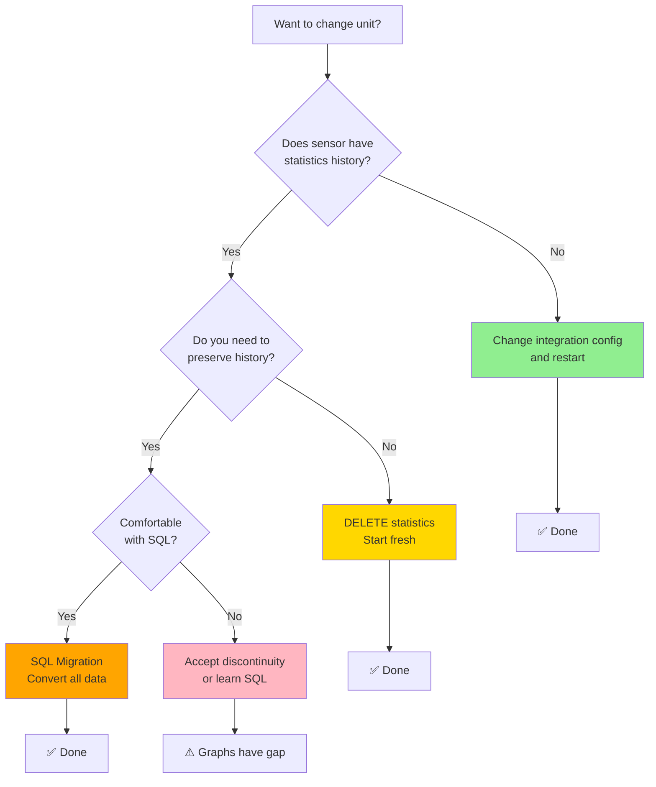

# Changing Unit of Measurement

## Overview

Changing the unit of measurement for a sensor that already has statistics is one of the most confusing and problematic aspects of Home Assistant's statistics system. This section explains why the UI appears to offer a unit change feature that doesn't actually work, and provides tested solutions for properly changing units.

---

## The Problem: The UI Setting That Doesn't Work

### What Appears to Happen

Home Assistant's UI offers a "Unit of measurement" setting that seems straightforward:

1. Navigate to **Settings → Devices & Services → Entities**
2. Find your sensor (e.g., `sensor.energy_meter`)
3. Click the gear icon (⚙️)
4. Change "Unit of measurement" dropdown
5. Click "Update"

The change appears to save successfully. **However, nothing actually changes.**

### What Actually Happens

When you change the unit via the UI:

**✅ What does happen:**

- Entity registry file (`.storage/core.entity_registry`) updates immediately
- The field `options.sensor.unit_of_measurement` reflects your change

**❌ What does NOT happen:**

- The displayed unit stays the same
- Statistics metadata remains unchanged
- Historical data remains in the old unit
- New statistics continue recording in the old unit
- The sensor state attributes show the old unit

**Result:** The UI change is stored but completely ignored by Home Assistant.

### Why This Happens

Home Assistant uses **three separate places** to store unit information:

```text
┌─────────────────────────────────────────────────────┐
│ 1. statistics_meta table                            │
│    - Controls what UI displays                      │
│    - Controls statistics recording                  │
│    - NOT updated when entity registry changes       │
│    - HIGHEST PRIORITY (if exists)                   │
└─────────────────────────────────────────────────────┘
                       ↓
         (if no statistics_meta exists)
                       ↓
┌─────────────────────────────────────────────────────┐
│ 2. Integration/Sensor Configuration                 │
│    - What sensor actually reports                   │
│    - Used when creating NEW statistics_meta         │
│    - Used for display if no statistics exist        │
└─────────────────────────────────────────────────────┘
                       ↓
            (essentially ignored)
                       ↓
┌─────────────────────────────────────────────────────┐
│ 3. Entity Registry (options.sensor.unit_of_...)    │
│    - Stored when you change via UI                  │
│    - ❌ Has NO effect on display                    │
│    - ❌ Has NO effect on statistics                 │
│    - Purpose unclear (future feature?)              │
└─────────────────────────────────────────────────────┘
```

**Key insight:** Once statistics exist, `statistics_meta.unit_of_measurement` takes complete control and ignores everything else.

---

## Empirical Testing Results

These findings are based on systematic testing on a live Home Assistant system.

### Test 1: UI Change Has No Effect

**Setup:**

- Sensor: `sensor.linky_easf01` (energy counter)
- Current state: 72,831.616 kWh
- Statistics exist with unit: kWh

**Actions:**

1. Changed unit to "Wh" via UI (Settings → Entities → ⚙️)
2. Verified entity registry updated: `"unit_of_measurement": "Wh"`
3. Closed and reopened UI
4. Restarted Home Assistant

**Results:**

| Check | Expected | Actual | Result |
|-------|----------|--------|--------|
| Entity Registry | Wh | ✅ Wh | Updated |
| statistics_meta | Wh | ❌ kWh | Unchanged |
| UI Display | Wh | ❌ kWh | Unchanged |
| Developer Tools | Wh | ❌ kWh | Unchanged |
| State Value | 72,831,616 Wh | ❌ 72,831.616 kWh | Unchanged |

**Conclusion:** UI change stored but has zero effect.

### Test 2: Statistics Metadata Controls Display

**Action:**

```sql
UPDATE statistics_meta 
SET unit_of_measurement = 'Wh'
WHERE statistic_id = 'sensor.linky_easf01';
```

**Results:**

| Check | Before | After | Changed? |
|-------|--------|-------|----------|
| statistics_meta | kWh | ✅ Wh | Yes |
| UI Display Unit | kWh | ✅ Wh | Yes! |
| Developer Tools Unit | kWh | ✅ Wh | Yes! |
| State Value | 72,831.616 | ❌ 72,831.616 | No (wrong scale!) |
| Existing Statistics | kWh scale | ❌ kWh scale | No |

**Conclusion:** Statistics metadata controls display, but existing data has wrong scale.

### Test 3: Fresh Start Works Correctly

**Actions:**

1. Deleted all statistics:

   ```sql
   DELETE FROM statistics WHERE metadata_id = [id];
   DELETE FROM statistics_short_term WHERE metadata_id = [id];
   DELETE FROM statistics_meta WHERE id = [id];
   ```

2. Restarted Home Assistant
3. Waited 5 minutes for new statistics to generate

**Results:**

| Check | Result | Details |
|-------|--------|---------|
| UI Display | ✅ Wh | Correct unit |
| State Value | ✅ 72,835,072.000 Wh | Correct scale |
| Developer Tools | ✅ `unit_of_measurement: Wh` | Matches integration |
| Integration Logs | ✅ Sending Wh | `'linky_easf01' >> 72835072.000 Wh` |
| New statistics_meta | ✅ Created (id=93) | unit = Wh |
| New short-term stats | ✅ Populated | Values in Wh scale |

**Conclusion:** Deleting statistics allows Home Assistant to use the integration's current unit.

---

## How to Properly Change Units

### Decision Tree



### Option A: Sensor Has NO Statistics Yet (Easy)

If you just created the sensor or it hasn't generated statistics yet:

**Steps:**

1. Change the integration/sensor configuration:

   ```yaml
   # ESPHome example
   sensor:
     - platform: ...
       name: "Energy Meter"
       unit_of_measurement: "Wh"  # Your preferred unit
       device_class: energy
       state_class: total_increasing
   ```

2. Restart Home Assistant

3. Verify in Developer Tools → States:

   ```yaml
   sensor.energy_meter:
     state: 12345.0
     unit_of_measurement: Wh  ← Should show new unit
   ```

**That's it!** When statistics are first created, they'll use this unit.

### Option B: Delete Statistics (Simple but Destructive)

**Use when:**

- Historical data isn't critical
- Sensor is relatively new
- You want the simplest solution
- You're willing to lose history

**Steps:**

#### 1. Backup Your Database

```bash
# SSH or Terminal access required
cd /config
cp home-assistant_v2.db backup_$(date +%Y%m%d_%H%M%S).db
```

#### 2. Find the Metadata ID

```sql
SELECT id, statistic_id, unit_of_measurement
FROM statistics_meta
WHERE statistic_id = 'sensor.your_sensor_name';
```

Example result:

```text
| id | statistic_id           | unit_of_measurement |
|----|------------------------|---------------------|
| 42 | sensor.energy_meter    | kWh                 |
```

#### 3. Delete All Statistics

```sql
-- Replace 42 with your metadata_id
DELETE FROM statistics WHERE metadata_id = 42;
DELETE FROM statistics_short_term WHERE metadata_id = 42;
DELETE FROM statistics_meta WHERE id = 42;
```

#### 4. Verify Deletion

```sql
-- Should return 0 rows
SELECT COUNT(*) FROM statistics WHERE metadata_id = 42;
SELECT COUNT(*) FROM statistics_short_term WHERE metadata_id = 42;
SELECT COUNT(*) FROM statistics_meta WHERE id = 42;
```

#### 5. Restart Home Assistant

```bash
ha core restart
```

#### 6. Wait and Verify

After 5-10 minutes, statistics will automatically regenerate:

```sql
-- Check new statistics metadata was created
SELECT id, statistic_id, unit_of_measurement
FROM statistics_meta
WHERE statistic_id = 'sensor.your_sensor_name';

-- Should show your sensor's current unit
```

**Verify in UI:**

- Developer Tools → States: Check unit_of_measurement
- History graph: Should show new unit
- Statistics graph: New data in new unit

### Option C: SQL Migration (Preserve All History)

**Use when:**

- You need continuous historical data
- You're comfortable with SQL
- You understand unit conversions
- You have a good backup

**Steps:**

#### 1. Backup Your Database

**⚠️ CRITICAL: Do not skip this step!**

```bash
cd /config
cp home-assistant_v2.db backup_before_migration_$(date +%Y%m%d_%H%M%S).db
```

#### 2. Identify Conversion Factor

Common conversions:

| From | To | Multiply by | Divide by | Notes |
|------|----|-----------|-|---------|
| kWh | Wh | 1000 | - | Energy: smaller unit |
| Wh | kWh | - | 1000 | Energy: larger unit |
| kWh | MWh | - | 1000 | Energy: much larger |
| MWh | kWh | 1000 | - | Energy: much smaller |
| W | kW | - | 1000 | Power |
| °C | °F | - | - | Use formula: (C × 9/5) + 32 |
| °F | °C | - | - | Use formula: (F - 32) × 5/9 |

#### 3. Update Statistics Metadata

```sql
UPDATE statistics_meta 
SET unit_of_measurement = 'Wh'  -- Your new unit
WHERE statistic_id = 'sensor.energy_meter';
```

#### 4. Convert Historical Statistics

**For counter sensors (energy, water, gas):**

```sql
-- Example: kWh → Wh (multiply by 1000)
UPDATE statistics
SET 
  state = state * 1000,
  sum = sum * 1000
WHERE metadata_id = (
  SELECT id FROM statistics_meta 
  WHERE statistic_id = 'sensor.energy_meter'
);

UPDATE statistics_short_term
SET 
  state = state * 1000,
  sum = sum * 1000
WHERE metadata_id = (
  SELECT id FROM statistics_meta 
  WHERE statistic_id = 'sensor.energy_meter'
);
```

**For measurement sensors (temperature, humidity, power):**

```sql
-- Example: kW → W (multiply by 1000)
UPDATE statistics
SET 
  mean = mean * 1000,
  min = min * 1000,
  max = max * 1000
WHERE metadata_id = (
  SELECT id FROM statistics_meta 
  WHERE statistic_id = 'sensor.power_meter'
);

UPDATE statistics_short_term
SET 
  mean = mean * 1000,
  min = min * 1000,
  max = max * 1000
WHERE metadata_id = (
  SELECT id FROM statistics_meta 
  WHERE statistic_id = 'sensor.power_meter'
);
```

**Special case: Temperature °C ↔ °F:**

```sql
-- °C → °F: (C × 9/5) + 32
UPDATE statistics
SET 
  mean = (mean * 9.0 / 5.0) + 32,
  min = (min * 9.0 / 5.0) + 32,
  max = (max * 9.0 / 5.0) + 32
WHERE metadata_id = (
  SELECT id FROM statistics_meta 
  WHERE statistic_id = 'sensor.temperature'
);

UPDATE statistics_short_term
SET 
  mean = (mean * 9.0 / 5.0) + 32,
  min = (min * 9.0 / 5.0) + 32,
  max = (max * 9.0 / 5.0) + 32
WHERE metadata_id = (
  SELECT id FROM statistics_meta 
  WHERE statistic_id = 'sensor.temperature'
);
```

#### 5. Verify Conversion

```sql
-- Check a few recent statistics values
SELECT 
  datetime(start_ts, 'unixepoch', 'localtime') as period,
  state,
  sum,
  mean,
  min,
  max
FROM statistics
WHERE metadata_id = (
  SELECT id FROM statistics_meta 
  WHERE statistic_id = 'sensor.energy_meter'
)
ORDER BY start_ts DESC
LIMIT 10;
```

**Sanity checks:**

- Values should be scaled correctly (e.g., kWh 72.5 → Wh 72500)
- No NULL values introduced
- No negative values where they shouldn't exist
- Decimal precision preserved

#### 6. Restart Home Assistant

```bash
ha core restart
```

#### 7. Verify Everything

**Check Developer Tools → States:**

```yaml
sensor.energy_meter:
  state: 72500
  unit_of_measurement: Wh  ← New unit
```

**Check History Graph:**

- Should show continuous data
- Values should make sense in new unit
- No sudden jumps or discontinuities

**Check Statistics:**

```sql
-- Compare oldest and newest statistics
SELECT 
  datetime(MIN(start_ts), 'unixepoch', 'localtime') as first_stat,
  datetime(MAX(start_ts), 'unixepoch', 'localtime') as last_stat,
  COUNT(*) as total_records
FROM statistics
WHERE metadata_id = (
  SELECT id FROM statistics_meta 
  WHERE statistic_id = 'sensor.energy_meter'
);
```

Should show full date range preserved.

### Option D: Accept Discontinuity (Compromise)

**Use when:**

- You want to preserve old data as-is
- You're okay with graphs showing a discontinuity
- You want to document when the change occurred

**Steps:**

1. **Change integration config** to new unit
2. **Restart Home Assistant**
3. **Document the change** in your config:

```yaml
# configuration.yaml
sensor:
  - platform: ...
    name: "Energy Meter"
    unit_of_measurement: "Wh"
    # NOTE: Changed from kWh to Wh on 2026-02-08
    # Historical data before this date is in kWh
    # Data after this date is in Wh
```

1. **Create a markdown note** (optional):

```markdown
# Sensor Unit Changes

## sensor.energy_meter
- **Before 2026-02-08**: kWh (statistics_meta id=42)
- **After 2026-02-08**: Wh (statistics_meta id=93)

To query both periods:
- Old data: WHERE metadata_id = 42 (values in kWh)
- New data: WHERE metadata_id = 93 (values in Wh)
```

**Result:**

- Old statistics: Remain in kWh (metadata_id = 42)
- New statistics: Created in Wh (metadata_id = 93)
- Graphs show discontinuity at change date
- Both data sets preserved and queryable

---

## MariaDB/PostgreSQL Versions

If you're using MariaDB or PostgreSQL instead of SQLite, use these adapted queries:

### MariaDB

```sql
-- Update metadata
UPDATE statistics_meta 
SET unit_of_measurement = 'Wh'
WHERE statistic_id = 'sensor.energy_meter';

-- Convert counter statistics (kWh → Wh)
UPDATE statistics s
JOIN statistics_meta sm ON s.metadata_id = sm.id
SET 
  s.state = s.state * 1000,
  s.sum = s.sum * 1000
WHERE sm.statistic_id = 'sensor.energy_meter';

UPDATE statistics_short_term sst
JOIN statistics_meta sm ON sst.metadata_id = sm.id
SET 
  sst.state = sst.state * 1000,
  sst.sum = sst.sum * 1000
WHERE sm.statistic_id = 'sensor.energy_meter';

-- Verify
SELECT 
  FROM_UNIXTIME(start_ts) as period,
  state,
  sum
FROM statistics
WHERE metadata_id = (SELECT id FROM statistics_meta WHERE statistic_id = 'sensor.energy_meter')
ORDER BY start_ts DESC
LIMIT 10;
```

### PostgreSQL

```sql
-- Update metadata
UPDATE statistics_meta 
SET unit_of_measurement = 'Wh'
WHERE statistic_id = 'sensor.energy_meter';

-- Convert counter statistics (kWh → Wh)
UPDATE statistics
SET 
  state = state * 1000,
  sum = sum * 1000
FROM statistics_meta
WHERE statistics.metadata_id = statistics_meta.id
  AND statistics_meta.statistic_id = 'sensor.energy_meter';

UPDATE statistics_short_term
SET 
  state = state * 1000,
  sum = sum * 1000
FROM statistics_meta
WHERE statistics_short_term.metadata_id = statistics_meta.id
  AND statistics_meta.statistic_id = 'sensor.energy_meter';

-- Verify
SELECT 
  TO_TIMESTAMP(start_ts) AT TIME ZONE 'UTC' as period,
  state,
  sum
FROM statistics
WHERE metadata_id = (SELECT id FROM statistics_meta WHERE statistic_id = 'sensor.energy_meter')
ORDER BY start_ts DESC
LIMIT 10;
```

---

## Common Mistakes and How to Avoid Them

### Mistake 1: Changing Only the UI Setting

**What people do:**

- Go to Settings → Entities → sensor → ⚙️
- Change unit
- Click Update
- Expect it to work

**What happens:**

- Nothing (as documented above)

**Solution:**

- Use one of the methods above (Options A-D)

### Mistake 2: Forgetting to Convert Existing Data

**What people do:**

- Update `statistics_meta.unit_of_measurement`
- Restart HA
- Wonder why values look wrong

**What happens:**

- UI shows new unit (e.g., Wh)
- But values still in old scale (e.g., 72.5 instead of 72500)
- Graphs misleading

**Solution:**

- Always convert existing statistics values
- Or delete statistics and start fresh

### Mistake 3: Wrong Conversion Factor

**Examples:**

- Using × 100 instead of × 1000 (kWh → Wh)
- Forgetting temperature formula needs addition: (C × 9/5) + 32
- Reversing multiply/divide direction

**Solution:**

- Double-check conversion factor
- Test on a few sample values first
- Verify results make sense

### Mistake 4: Not Backing Up First

**What happens:**

- Apply wrong conversion
- Corrupt all historical data
- No way to undo

**Solution:**

- **ALWAYS backup before SQL modifications**
- Test queries on a copy first
- Keep multiple backup versions

### Mistake 5: Updating statistics but Not integration

**What people do:**

- Change statistics_meta to Wh
- Leave integration sending kWh

**What happens:**

- Historical data in Wh scale
- New data arriving in kWh scale
- New statistics recorded with wrong values

**Solution:**

- Ensure integration sends the same unit as statistics_meta
- Check Developer Tools → States after changes

---

## Prevention: Choosing Units Wisely

**The best solution is to choose the right unit from the start!**

### Recommendations by Sensor Type

| Sensor Type | Recommended Unit | Reason |
|-------------|------------------|--------|
| Household energy total | kWh | Most utility bills use kWh |
| Solar production | kWh | Industry standard, easier to read |
| Device power | W | Direct measurement, no conversion |
| Temperature (US) | °F | User preference |
| Temperature (elsewhere) | °C | International standard |
| Water usage | L | Direct meter reading |
| Gas usage | m³ | Utility standard |
| Distance tracking | km or mi | User preference |

### Unit Selection Checklist

Before configuring a new sensor with statistics:

- [ ] Check what unit your data source provides natively
- [ ] Check what unit your utility bills use (for energy/water/gas)
- [ ] Check what unit makes values readable (avoid very large/small numbers)
- [ ] Consider future integrations (energy dashboard prefers kWh)
- [ ] Document your choice in configuration comments
- [ ] Stick with it once statistics start generating

### Example Well-Documented Sensor

```yaml
template:
  - sensor:
      - name: "Solar Production Total"
        unique_id: solar_production_kwh
        # Unit choice: kWh
        # Reason: Matches utility billing, readable scale (avoid 50,000,000 Wh)
        # DO NOT CHANGE - Statistics created 2025-01-01
        unit_of_measurement: "kWh"
        device_class: energy
        state_class: total_increasing
        state: "{{ (states('sensor.solar_raw') | float(0) / 1000) | round(3) }}"
        availability: "{{ states('sensor.solar_raw') not in ['unavailable', 'unknown'] }}"
```

---

## Troubleshooting

### Problem: UI Still Shows Old Unit After Changes

**Possible causes:**

1. **Statistics metadata not updated:**

   ```sql
   -- Check current value
   SELECT unit_of_measurement 
   FROM statistics_meta 
   WHERE statistic_id = 'sensor.your_sensor';
   ```

2. **Browser cache:**
   - Hard refresh: Ctrl+Shift+R (Cmd+Shift+R on Mac)
   - Clear browser cache
   - Try incognito/private window

3. **Home Assistant cache:**

   ```bash
   # Restart HA
   ha core restart
   ```

### Problem: Values Wrong After Unit Change

**Symptom:** Unit shows Wh, but values like 72.5 (should be 72500)

**Cause:** Statistics metadata updated but historical data not converted

**Solution:** Run conversion SQL (see Option C above)

```sql
-- For counter type (kWh → Wh)
UPDATE statistics
SET state = state * 1000, sum = sum * 1000
WHERE metadata_id = (SELECT id FROM statistics_meta WHERE statistic_id = 'sensor.your_sensor');
```

### Problem: Duplicate Statistics with Different Units

**Symptom:** Two entries in statistics_meta with same statistic_id

```sql
SELECT id, statistic_id, unit_of_measurement
FROM statistics_meta
WHERE statistic_id = 'sensor.energy_meter';

| id | statistic_id           | unit  |
|----|------------------------|-------|
| 42 | sensor.energy_meter    | kWh   |
| 93 | sensor.energy_meter    | Wh    |
```

**Cause:** Unit changed at integration level, new statistics_meta created

**Solutions:**

**Option 1: Merge the data (advanced)**

1. Convert old statistics to new unit
2. Reassign old statistics to new metadata_id
3. Delete old metadata

```sql
-- Convert old data
UPDATE statistics SET state = state * 1000, sum = sum * 1000 WHERE metadata_id = 42;

-- Reassign to new metadata
UPDATE statistics SET metadata_id = 93 WHERE metadata_id = 42;

-- Delete old metadata
DELETE FROM statistics_meta WHERE id = 42;
```

**Option 2: Keep both** (document the split)

- Query old data: `WHERE metadata_id = 42`
- Query new data: `WHERE metadata_id = 93`
- Note in documentation when split occurred

### Problem: Statistics Not Generating After Changes

**Symptoms:**

- Sensor shows correct unit in Developer Tools
- But no statistics appearing
- Empty statistics_meta or no new records

**Possible causes:**

1. **Missing state_class:**

   ```yaml
   # Check your sensor has this:
   state_class: measurement  # or total_increasing
   ```

2. **Invalid values:**
   - Sensor returning "unavailable" or "unknown"
   - Non-numeric values
   - Check logs for warnings

3. **Recorder exclusion:**

   ```yaml
   # Check recorder config doesn't exclude this entity
   recorder:
     exclude:
       entities:
         - sensor.your_sensor  # ← Remove this
   ```

4. **Statistics compiler paused:**

   ```bash
   # Check HA logs
   grep "statistics" /config/home-assistant.log
   ```

**Solutions:**

- Verify sensor configuration
- Check Developer Tools → States for valid numeric values
- Wait 5-10 minutes for statistics to generate
- Check HA logs for errors

---

## Summary

### Key Takeaways

1. **The UI unit setting doesn't work** for sensors with existing statistics
2. **statistics_meta.unit_of_measurement** is what actually controls display
3. **Changing units requires SQL** or deleting statistics entirely
4. **Choose units carefully from the start** - changing is painful
5. **Always backup before SQL modifications**

### Quick Reference

| Scenario | Solution | Difficulty | Data Loss? |
|----------|----------|------------|------------|
| No statistics yet | Change integration config | Easy | No |
| Don't need history | Delete statistics | Easy | Yes |
| Need continuous history | SQL migration | Advanced | No |
| Need both old and new | Accept discontinuity | Medium | No |

### When in Doubt

**Simplest safe approach:**

1. Backup database
2. Delete statistics (Option B)
3. Let them regenerate with current unit
4. Accept loss of historical data

**Most complete approach:**

1. Backup database
2. SQL migration (Option C)
3. Convert all historical values
4. Continuous data preserved

---

## Additional Resources

**Official Documentation:**

- [Home Assistant Statistics](https://www.home-assistant.io/docs/backend/database/#statistics)
- [Recorder Integration](https://www.home-assistant.io/integrations/recorder/)
- [Sensor Entity](https://developers.home-assistant.io/docs/core/entity/sensor/)

**Community:**

- [Home Assistant Forum - Statistics](https://community.home-assistant.io/c/configuration/statistics)
- [GitHub - Recorder Issues](https://github.com/home-assistant/core/labels/integration%3A%20recorder)

**Related Documentation Sections:**

- [Part 1: Foundational Concepts](part1_fundamental_concepts.md) - Understanding states vs statistics
- [Part 2: Statistics Generation](part2_statistics_generation.md) - How statistics are created
- [Part 4: Best Practices](part4_practices_troubleshooting.md) - Choosing state_class correctly
- [Part 5: Finding & Fixing Errors](part5_find_fix.md)
---

**Previous** - [Appendix 1: Setting Units](apdx_1_set_units.md)  
**Next** - [Appendix 3: Mysterious Statistics fields](apdx_3_stat_fields.md)

