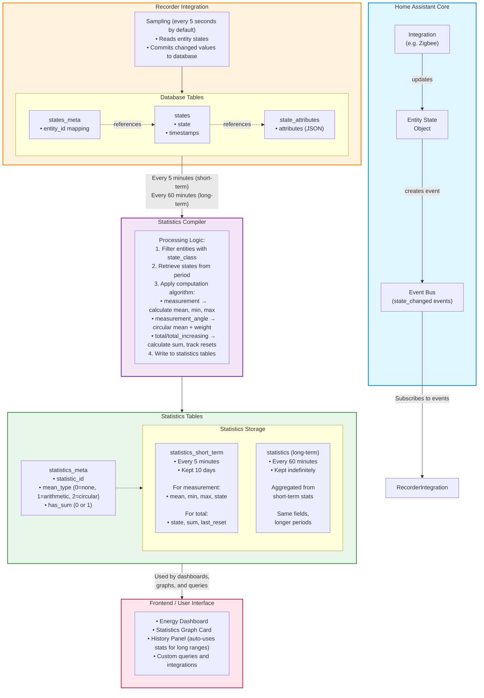

# Part 2: Statistics Generation

## 2.1 What Are Statistics?

Home Assistant supports statistics, which are **aggregated and compressed representations** of entity data over time. Unlike the `states` table, which stores every state change, the statistics system stores information at regular intervals:

- **Short-term statistics**: Every 5 minutes (stored in `statistics_short_term` table)
- **Long-term statistics**: Every hour (stored in `statistics` table)

This dramatically reduces storage requirements while preserving trend data.

**Short-term vs Long-term Statistics**

| Aspect         | Short-term Statistics    | Long-term Statistics               |
| ---------------- | -------------------------- | ------------------------------------ |
| **Interval**   | 5 minutes                | 1 hour                             |
| **Retention**  | 10 days (auto-purged, configurable via `auto_purge`) | Indefinite (unless manually purged) |
| **Table**      | `statistics_short_term`  | `statistics`                       |
| **Purpose**    | Recent detailed trends   | Historical trend analysis          |
| **Generation** | Direct from states table | Aggregated from short-term stats   |

## 2.2 Which Entities Generate Statistics?

Statistics are automatically generated for **entities** that meet certain criteria. While most statistical entities are in the `sensor` domain, ANY entity with an appropriate `state_class` can generate statistics, regardless of domain (e.g. number, input_number, counter,...)

> For example of statistics from non-sensor domains see [Statistics domains](apdx_4_stat_domains.md)

Statistical entities can be classified into two categories: **measurement statistics** and **counter statistics**.

> **TL;DR**: Measurement statistics track min/max/mean of current values (like temperature). Counter statistics track cumulative totals (like energy consumption). Choose `state_class` based on whether you want trends or totals.

### Measurement Type

They represent a **measurement**

**Requirements:**

- `state_class` property must be set to `measurement` or `measurement_angle`
- The `device_class` must *not* be a non-numeric type such as `date`, `enum`, `timestamp`, or certain special-purpose classes like `energy`, `gas`, `monetary`, `volume`, or `water` that have specific handling requirements.
- Must have a `unit_of_measurement` defined

> **Note:** See the [official sensor device classes](https://www.home-assistant.io/integrations/sensor/#device-class) for the current complete list.

**What is tracked:**
Home Assistant tracks the **min**, **max**, and **mean** values during each statistics period, updating them every 5 minutes.

**Important:** The `state` of "measurement statistics" represents a **real-time measurement at a point in time**, such as current temperature, humidity, or electrical power. Their state should represent a **current measurement**, not historical data, aggregations, or forecasts.

### Measurement Subtypes

The Measurement Statistics type can be further divided into two subtypes

**1. `state_class: measurement`**

The state represents a value e.g., a temperature sensor.

**2. `state_class: measurement_angle`**
For sensors with `state_class: measurement_angle`, the state represents a real-time measurement for angles measured in degrees (°), such as current wind direction. These use **circular mean** calculations to correctly average angles.

### Counter Type

They represent a **total amount**

**Requirements:**

- `state_class` property must be set to `total` or `total_increasing`
- May use the `last_reset` attribute
- Must have a `unit_of_measurement` defined

**What is tracked:**
Home Assistant tracks the **state**, **sum**, and **last_reset** values during each statistics period, updating them every 5 minutes.

**The sum field:**
The **sum** field tracks the cumulative growth/change over time:

- For counters that reset: sum tracks total consumption across resets
- For monotonically increasing counters: sum = current_value - initial_value
- State changes are converted to growth/consumption amounts

**The state fields:**
The state of "counter statistics" represents a total amount. Entities tracking a total amount have a value that may optionally reset periodically, such as:

- This month's energy consumption
- Today's energy production
- The weight of pellets used to heat the house over the last week

The sensor's value when the first statistics is compiled is used as the initial zero-point.

**The last_reset fields**

`last_reset` indicates when the counter was reset to zero (e.g., start of a new billing period). When `last_reset` changes, the `state` must be a valid number.

### Counter Subtypes

The Counter Statistics type can be further divided into two subtypes

**1. `state_class: total`**

The state represents a total amount that can both **increase and decrease**, e.g., a net energy meter. The`last_reset` indicates when the counter was reset to zero (e.g., start of a new billing period). When `last_reset` changes, the `state` must be a valid number.

**2. `state_class: total_increasing`**

Similar to `state_class: total` with the restriction that the state represents a **monotonically increasing positive total** which periodically restarts counting from 0, e.g., a daily amount of consumed gas, weekly water consumption, or lifetime energy consumption.

## 2.3 Statistics Generation

Home Assistant provides support to process statistics through the following workflow:

1. **Entity state changes** are recorded in the `states` table
2. **Every 5 minutes**, state values are processed and written to `statistics_short_term` table
3. **Every 60 minutes**, short-term statistics are aggregated into `statistics` table

**Important Notes on Statistics Generation**

- **No retroactive generation**: Statistics are only generated going forward from when `state_class` is first set
- **Historical states are not converted**: States recorded before `state_class` was added will not be converted to statistics
- **Missing data handling**: Gaps in state data create gaps in statistics
- **State class changes**: If you change an entity's `state_class`, a new `statistic_id` may be created, resulting in discontinuous statistics. Plan state class assignments carefully.
- **Unit changes**: Changing `unit_of_measurement` creates a new statistic series. Convert at the source if possible.

## 2.4 Statistics Computation

It's worth noting that the `statistics/statistics_short_term` tables are not entirely built from `states`. In practice, the statistics compiler pulls data from multiple recorder sources:

- **`states` / `states_meta`**: state changes
- **`state_attributes`**: needed because statistics often rely on the entity's `state_class`, `device_class`, `unit_of_measurement`, etc.
- **`statistics` itself**: Home Assistant can continue long-term statistics by using the previous statistics row as the starting point
- **(Sometimes) `events`**: some integrations rely on event history

> Statistics are computed from *recorded history*, which includes `states`, but may also require metadata/attributes and may chain from previously compiled statistics for continuity.

### Measurement type

For entities with `state_class: measurement` or `measurement_angle`, Home Assistant calculates **min**, **max**, and **mean** values during each statistics period.

**Data Collection:**

- Every 5 seconds (by default), the Recorder samples the current entity state
- Only valid numeric states are considered (`unavailable` and `unknown` are excluded)
- Non-numeric values and unit changes are skipped

**Calculation Process (per 5-minute or 1-hour period):**

- The calculation process differ for the two subtypes

**Storage:**

- In `statistics_meta`: `mean_type=1` (arithmetic), or `mean_type=2` (circular) and `has_sum=0`
- In `statistics`/`statistics_short_term`: `mean`, `min`, `max` are populated; `state`, `sum` and `last_reset_ts` are NULL

#### Arithmetic subtype

For entities with `state_class: measurement` an **arithmetic mean** average is used

**Arithmetic mean calculation:**

- **Mean (Arithmetic Average)**:
  - Sum all valid numeric state values in the period
  - Divide by the number of valid samples
  - Formula: `mean = Σ(state_values) / n`
  - Example: States [2040, 2030, 2023] → mean = 2031
- **Min (Minimum)**:
  - The lowest valid numeric value observed during the period
  - Example: States [2040, 2030, 2023] → min = 2023
- **Max (Maximum)**:
  - The highest valid numeric value observed during the period
  - Example: States [2040, 2030, 2023] → max = 2040

#### Circular subtype

For entities with `state_class: measurement_angle`  a **circular mean** average is used

Angular measurements (like wind direction in degrees) require special handling because standard arithmetic averaging fails for angles. For example, the average of 350° and 10° should be 0° (North), not 180° (South).

**Circular Mean Calculation:**

1. Convert each angle θ to unit vectors:
   - x = cos(θ)
   - y = sin(θ)

2. Calculate average vector components:
   - mean_x = Σ(cos(θᵢ)) / n
   - mean_y = Σ(sin(θᵢ)) / n

3. Convert back to angle:
   - mean = atan2(mean_y, mean_x)

4. **Mean Weight**:
   - Stored as the length of the average vector: `sqrt(mean_x² + mean_y²)`
   - Range: 0 to 1
   - Values close to 1 indicate consistent direction (e.g., steady north wind)
   - Values close to 0 indicate scattered/variable directions (e.g., swirling wind)
   - This helps distinguish between "average direction is 0°" (all measurements near 0°) vs "average direction is 0°" (equal mix of 350° and 10°)

### Counter type

For entities with `state_class` set to `total` or `total_increasing`, Home Assistant tracks cumulative values using **state**, **sum**, and **last_reset**.

**Understanding the Fields**

**`state`**: The absolute meter/counter reading at the end of the period

- For energy meters: the total lifetime kWh reading
- Example: 72201200.0 kWh (absolute meter value)

**`sum`**: The cumulative growth/consumption since statistics began

- Represents total consumption from the statistics "zero point"
- When statistics first start, the initial state becomes the baseline
- sum = current_state - initial_state (when statistics began)

**`last_reset_ts`**: Timestamp when the counter was last reset (if applicable)

- Read from the entity's `last_reset` attribute
- NULL for lifetime counters that never reset

#### Total_increasing subtype

For entities with `state_class: total_increasing` (Monotonically Increasing)

**Characteristics:**

- Counter only increases (or resets to zero/low value)
- Examples: Energy consumption, water usage, production counters

**Calculation Process:**

1. **State**: Last valid numeric value at end of period
2. **Sum Calculation**:

   - First statistics record: `sum = state - initial_state` (usually 0 or small value)
   - Subsequent records: `sum = previous_sum + (current_state - previous_state)`
   - If `current_state < (previous_state * 0.9)` (10% or more decrease detected): treat as counter reset
     - Continue sum calculation: `sum = previous_sum + current_state` (assuming reset to 0)
   - Sum continuously accumulates, even across meter resets
3. **Last Reset**: Usually NULL unless entity provides `last_reset` attribute

**Note:** Home Assistant uses a **10% threshold** to detect resets rather than treating any small decrease as a reset. This prevents false reset detection from floating-point rounding errors or minor sensor glitches.

**Example:**

```text
13:00: state=72199616, sum=294296 (previous_sum + delta since 12:55)
13:05: state=72199768, sum=294448 (294296 + 152)
13:10: state=72199920, sum=294600 (294448 + 152)
...
14:00: state=72201200, sum=295880 (accumulated growth)
```

#### Total subtype

For entities with `state_class: total` (Can Increase or Decrease)

**Characteristics:**

- Counter can increase OR decrease
- Examples: Net energy meter (with solar), battery charge level as counter

**Calculation Process:**

1. **State**: Last valid numeric value at end of period
2. **Sum Calculation**:
   - If `last_reset` hasn't changed: `sum = previous_sum + (current_state - previous_state)`
   - If `last_reset` changed: reset detected, restart accumulation
3. **Last Reset**:
   - Copied from entity's `last_reset` attribute
   - When this changes, sum calculation restarts

**Storage:**

- In `statistics_meta`: `mean_type=0` (none), `has_sum=1`
- In `statistics`/`statistics_short_term`: `state`, `sum`, and `last_reset_ts` are populated; `mean`, `min`, `max` are NULL

#### Computing Delta/Growth

While the statistics tables store cumulative `sum` values, dashboards and graphs often need to display **consumption or growth during a specific period**. This delta is computed from the `sum` field.

**Formula**

- Delta (consumption/growth) = sum_end - sum_start

Where:

- `sum_start` = sum value at the beginning of the desired period
- `sum_end` = sum value at the end of the desired period

**Example: Hourly Energy Consumption**

```sql
SELECT 
  sm.statistic_id,
  datetime(s.start_ts, 'unixepoch', 'localtime') as period_start,
  s.sum as cumulative_sum,
  s.sum - LAG(s.sum) OVER (ORDER BY s.start_ts) as period_consumption
FROM statistics s
INNER JOIN statistics_meta sm ON s.metadata_id = sm.id
WHERE sm.statistic_id = 'sensor.linky_east'
  AND datetime(s.start_ts, 'unixepoch', 'localtime') >= '2026-01-27 12:00:00'
  AND datetime(s.start_ts, 'unixepoch', 'localtime') < '2026-01-27 15:00:00'
ORDER BY s.start_ts;
```

Result:

| statistic_id      | period_start    | cumulative_sum | period_consumption |
| ------------------- | ----------------- | ---------------- | -------------------- |
| sensor.linky_east | 1/27/2026 12:00 | 294136         | NULL               |
| sensor.linky_east | 1/27/2026 13:00 | 295880         | 1744               |
| sensor.linky_east | 1/27/2026 14:00 | 297544         | 1664               |

**Interpretation:**

- Between 12:00-13:00: consumed 1744 Wh (1.74 kWh)
- Between 13:00-14:00: consumed 1664 Wh (1.66 kWh)

**How Statistics Graph Card Uses This**

The built-in statistics graph card:

1. Queries the relevant statistics rows for the time range
2. Calculates deltas: `consumption_in_period[i] = sum[i] - sum[i-1]`
3. Displays as bar chart (for consumption) or line chart (for cumulative)

This is why the `sum` field exists: to enable efficient delta calculations without reprocessing all raw states.

## 2.5 Recorder Data Flow Diagram



**Note:** This diagram shows the primary data flow. Some integrations may provide statistics directly without going through the states table (external statistics).

**Time Flow Example (Energy Meter)**

```text
────────────────────────────────────────────────────────────────────────────
13:00:00  State: 72199488 ──┐
13:00:05  State: 72199490   ├─> Samples collected
13:00:10  State: 72199495   │   every 5 seconds
...                         │   (if changed)
13:04:55  State: 72199615   │
13:04:59  State: 72199616 ──┘
                            │
                13:05:00 ◄──┴── Statistics Compiler runs
                            │
                            └──> statistics_short_term:
                                 • start_ts: 13:00:00
                                 • state: 72199616
                                 • sum: 294296 (cumulative)
                                 • created_ts: 13:05:00

After 12 such 5-minute periods:
                            │
                14:00:00 ◄──┴── Long-term Compiler aggregates
                            │
                            └──> statistics:
                                 • start_ts: 13:00:00
                                 • state: 72201200 (end of hour)
                                 • sum: 295880
                                 • created_ts: 14:00:00
```

## 2.6 The Statistics Tables

### statistics_meta table

| Field                 | Description                                            | Example                                                   |
| ----------------------- | -------------------------------------------------------- | ----------------------------------------------------------- |
| `id`                  | Primary key, unique ID for each statistic              | 1, 2, 3...                                                |
| `statistic_id`        | Entity or statistic identifier                         | "sensor.linky_urms1", "external:water_daily" |
| `source`              | Where the statistic comes from                         | "recorder" (for internal), anything (for external) |
| `unit_of_measurement` | Unit of the data                                       | "V", "kWh", "W", "°C", "%"                               |
| `has_sum`             | Boolean: Does this statistic calculate cumulative sum? | 0 or 1                                                    |
| `name`                | Human-friendly name (optional)                         | "Living Room Temperature"                                 |
| `mean_type`           | Integer: What kind of mean calculation is used         | 0=none, 1=arithmetic, 2=circular                          |

**Understanding mean_type**

| mean_type  | Value | Meaning                  | Use Case                         |
| ------------ | ------- | -------------------------- | ---------------------------------- |
| None       | 0     | No mean calculated       | Counters, totals (energy meters) |
| Arithmetic | 1     | Standard arithmetic mean | Temperature, humidity, power     |
| Circular   | 2     | Circular/angular mean    | Wind direction, compass bearings |

**Mean_type / Has_sum Combination Table**

| mean_type | has_sum | Type                   | Columns Available     | Example              |
| ----------- | --------- | ------------------------ | ----------------------- | ---------------------- |
| 0         | 1       | Total/Counter          | sum, state            | Energy meter (Linky) |
| 1         | 0       | Arithmetic measurement | mean, min, max, state | Temperature, voltage |
| 2         | 0       | Circular measurement   | mean, min, max, state | Wind direction       |

**Note:** Any combination not listed above (e.g., `mean_type=1` with `has_sum=1`) is invalid and indicates a data integrity issue.

### statistics table

We only show the fields that are in use at the time of this writing. Other fields in the table are deprecated and should be ignored.

| Field           | Description                                                     | Example                             |
| ----------------- | ----------------------------------------------------------------- | ------------------------------------- |
| `id`            | Primary key for this statistic record                           | Auto-increment                      |
| `created_ts`    | When the statistics were calculated and written to the database | 2024-01-11 12:05:00                 |
| `metadata_id`   | Foreign key to statistics_meta                                  | References statistics_meta.id       |
| `start_ts`      | Unix timestamp of period start                                  | 2024-01-11 12:00:00 (start of hour) |
| `mean`          | Average value during the period                                 | 234.5 (average voltage)             |
| `mean_weight`   | Weight factor for circular averaging (angular measurements)     | 0.95 (high consistency)             |
| `min`           | Minimum value during the period                                 | 230.0 (lowest voltage)              |
| `max`           | Maximum value during the period                                 | 238.0 (highest voltage)             |
| `last_reset_ts` | When the counter last reset (for sum)                           | Timestamp of reset, or NULL         |
| `state`         | Last known state at end of period                               | 235.0 (final voltage reading)       |
| `sum`           | Cumulative sum (for counters like energy)                       | 1523.4 (total kWh)                  |

> See [Mysterious Statistics Fields](apdx_3_stat_fields.md) for a detailed description of the fields `mean_weight`, and `created_ts`

### statistics_short_term table

Same fields as statistics table, but for short term statistics.

## 2.7 Statistics tracking examples

We now look at what is stored in the statistics_short_term table and statistics table using the same practical examples used in [Part 1](part1_fundamental_concepts.md).

### ApparentPower Consumption

**Short Term Statistics**

| statistic_id        | period_start    | created_at      | mean        | min  | max  |
| --------------------- | ----------------- | ----------------- | ------------- | ------ | ------ |
| sensor.linky_sinsts | 1/27/2026 13:00 | 1/27/2026 13:05 | 2026.510631 | 1987 | 2040 |
| sensor.linky_sinsts | 1/27/2026 13:05 | 1/27/2026 13:10 | 1973.135533 | 1958 | 1989 |
| sensor.linky_sinsts | 1/27/2026 13:10 | 1/27/2026 13:15 | 1955.405006 | 1952 | 1959 |
| ...                 | ...             | ...             | ...         | ...  | ...  |

**Long Term Statistics**

| statistic_id        | period_start    | created_at      | mean        | min  | max  |
| --------------------- | ----------------- | ----------------- | ------------- | ------ | ------ |
| sensor.linky_sinsts | 1/27/2026 13:00 | 1/27/2026 14:00 | 1872.448359 | 1704 | 2040 |

### ZigBee Temperature Sensor

**Measurement Short Term Statistics**

| statistic_id | period_start | created_at | mean | min | max |
|--------------|--------------|------------|------|-----|-----|
| sensor.family_temperature | 1/27/2026 12:00 | 1/27/2026 12:05 | 13.61 | 13.59 | 13.63 |
| sensor.family_temperature | 1/27/2026 12:35 | 1/27/2026 12:40 | 13.60 | 13.60 | 13.60 |

### Energy Meter

**Counter Short Term Statistics**

| statistic_id      | period_start    | created_at      | state    | sum    | period_consumption |
| ------------------- | ----------------- | ----------------- | ---------- | -------- | -------------------- |
| sensor.linky_east | 1/27/2026 13:00 | 1/27/2026 13:05 | 72199616 | 294296 | -                  |
| sensor.linky_east | 1/27/2026 13:05 | 1/27/2026 13:10 | 72199768 | 294448 | 152                |
| sensor.linky_east | 1/27/2026 13:10 | 1/27/2026 13:15 | 72199920 | 294600 | 152                |
| ...               | ...             | ...             | ...      | ...    | ...                |

**Counter Long Term Statistics**

| statistic_id      | period_start    | created_at      | state    | sum    | period_consumption |
| ------------------- | ----------------- | ----------------- | ---------- | -------- | -------------------- |
| sensor.linky_east | 1/27/2026 12:00 | 1/27/2026 13:00 | 72199456 | 294136 | -                  |
| sensor.linky_east | 1/27/2026 13:00 | 1/27/2026 14:00 | 72201200 | 295880 | 1744               |
| sensor.linky_east | 1/27/2026 14:00 | 1/27/2026 15:00 | 72202864 | 297544 | 1664               |

**Previous** - [Part 1: Fundamental Concepts](part1_fundamental_concepts.md)
**Next** - [Part 3: Working with Statistics](part3_working_with_statistics.md)
