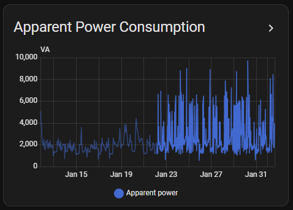
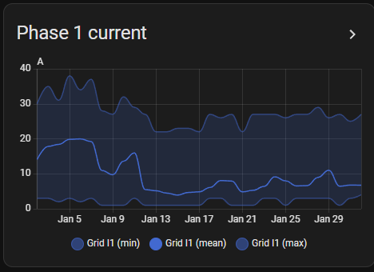

# Part 3: Working with Statistics

## 3.1 Benefits of Statistics

- **Reduced storage**: A temperature sensor updating every 30 seconds generates ~2,880 state records per day, but only 24 hourly statistics records (288 short-term records)
- **Faster queries**: Querying a year of hourly statistics (8,760 rows) vs. millions of state changes
- **Long-term retention**: Keep years of trend data without massive databases
- **Energy dashboard**: Powers the built-in energy monitoring features

## 3.2 Common Use Cases

- **Energy Monitoring**: Track total energy consumption with `total_increasing` state class, automatically handling meter resets.
- **Temperature Trends**: Use `measurement` state class to track min/max/average temperatures over months or years.
- **Cost Tracking**: Combine consumption statistics with pricing data to calculate costs.
- **Performance Analysis**: Identify patterns in system behavior over extended periods.

## 3.3 Accessing Statistics

### Via the UI

Short list of cards / Panels to display statistics

- [Developer Tools](https://www.home-assistant.io/docs/tools/dev-tools/) → Statistics
  Shows all recorded statistics in a table and allow to fix some problems.
- Energy Dashboard (for energy entities)
- [History panels](https://www.home-assistant.io/integrations/history/)
  Display entity state changes over time. Automatically switches to statistics-based rendering for date ranges beyond the `states` table retention period.

- [History graphs](https://www.home-assistant.io/dashboards/history-graph/)
  Is used to display **measurement** type statistics. It uses short term statistics to show detailed information (5 minutes sampling) during the retention period and long term statistic (1 hour sampling) for longer period.
  
- [Statistics graph card](https://www.home-assistant.io/dashboards/statistics-graph)
  Uses long term statistics to display **measurement** or **counter** type statistics.
  
  For **measurement** it can display the min, max, and mean information. In this case the chart type is usually set to line
  
  
  For **counter** it can display the state, sum, and delta change. To display change the chart type is usually set to bar and for sum it is set to line. Note that the sum displayed in period is not what is stored in the table as it always start at 0. This allow to more easily  read the consumption over the period.
   
  
- And many custom card

### Via Services

- `recorder.get_statistics`: retrieve statistics for entities over a specified period

### Via Database Query

For advanced analysis and custom integrations it can be useful to perform direct SQL queries of `statistics` and `statistics_short_term` tables. This can be done using the **SQLite web app** (if you use SQLite DB) or the **phpMyAdmin app** (if you are using MariaDB). It is also possible to query the database directly from a python program.

> Note: We are using the new terminology of **App** introduced in HA 2025.2 (previously called **Addon**)

You will find some examples of queries in [SQL Section](../sql/sql_overview.md)
For Python examples of querying statistics programmatically, see the [Home Assistant API documentation](https://developers.home-assistant.io/docs/api/rest/).

### 3.4 External Statistics

Home Assistant also supports **external statistics** - data injected from sources outside the normal entity system. These have:

- `source` field in `statistics_meta` set to a custom value (not "recorder")
- Custom `statistic_id` (e.g., "external:solar_production_forecast")
- Same table structure as internal statistics

External statistics are useful for:

- Importing historical data from other systems
- Creating custom aggregations
- Forecast data from external services

**Previous** - [Part 2: Statistics Generation](part2_statistics_generation.md)
**Next** - [Part 4_Best Practices and_Troubleshooting.md](part4_practices_troubleshooting.md)
