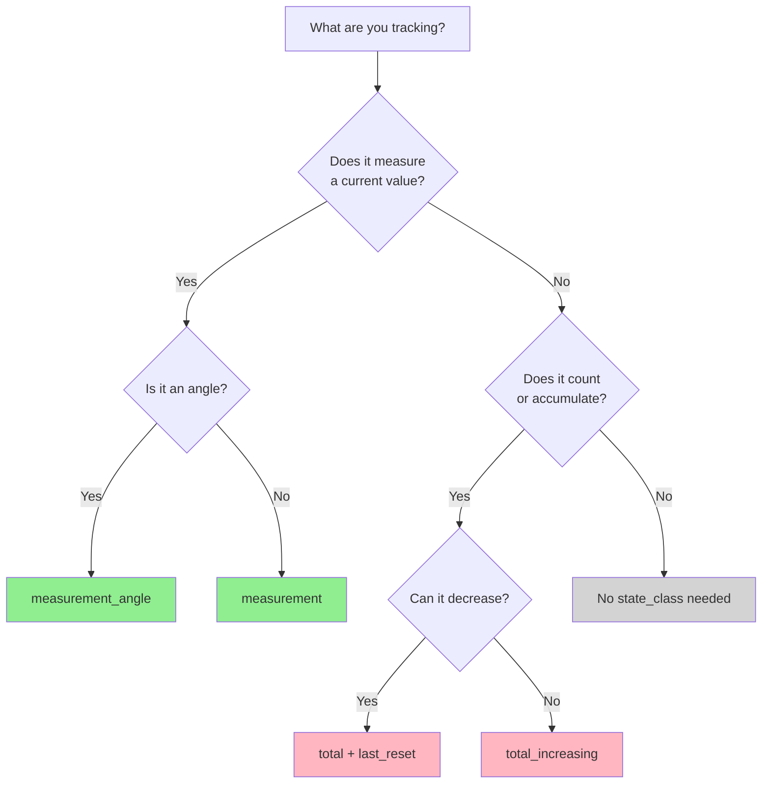

# Part 4: Best Practices and Troubleshooting

## 4.1 State Class Selection Guide

Use this table to quickly determine which `state_class` to use for your entity:

| **I want to track...**               | **Use state_class**                     | **Tracks**              | **Example**               | **Graph Shows**              |
| -------------------------------------- | ----------------------------------------- | ------------------------- | --------------------------- | ------------------------------ |
| Current temperature                  | `measurement`                           | mean, min, max, state   | Temperature sensor        | Average temp over time       |
| Current humidity                     | `measurement`                           | mean, min, max, state   | Humidity sensor           | Min/max/avg humidity         |
| Current power usage                  | `measurement`                           | mean, min, max, state   | Power meter               | Real-time wattage trends     |
| Wind direction                       | `measurement_angle`                     | circular mean, min, max | Wind compass              | Average direction (circular) |
| Total energy consumed (never resets) | `total_increasing`                      | state, sum              | Lifetime energy meter     | Cumulative consumption       |
| Energy meter (may reset)             | `total_increasing`                      | state, sum              | Monthly energy meter      | Handles meter resets         |
| Net energy (can go +/-)              | `total` with `last_reset`               | state, sum              | Solar net metering        | Bidirectional flow           |
| Differential energy readings         | `total` + update `last_reset` each time | state, sum              | "Last minute consumption" | Each reading as delta        |
| Binary sensor (on/off only)   | None (no `state_class`)              | -                       | Door sensor               | State history only       |
| Diagnostic data (not trends)  | None (no `state_class`)              | -                       | Firmware version          | No statistics needed     |

**Key Decision Points:**

- Does the value represent a **current moment** (temperature, power now)? → `measurement`
- Is it an **angle/direction**? → `measurement_angle`
- Does it **only increase** (or reset to zero)? → `total_increasing`
- Can it **increase AND decrease**? → `total` with `last_reset`

**Quick State Class Selection**



**Troubleshooting Decision Tree**

```text
┌─────────────────────────────────────┐
│  Statistics not showing for entity? │
└─────────────┬───────────────────────┘
              │
              ├─ NO state_class set? ───────────> Add state_class attribute
              │
              ├─ state_class exists?
              │   │
              │   ├─ Check unit_of_measurement
              │   │   │
              │   │   ├─ Missing? ─────────────> Add unit (e.g., "kWh", "°C")
              │   │   └─ Present?
              │   │
              │   ├─ Check if entity is excluded in recorder config
              │   │   │
              │   │   ├─ Excluded? ──────────> Remove from exclude list
              │   │   └─ Not excluded?
              │   │
              │   ├─ Check state values in states table
              │   │   │
              │   │   ├─ States = "unavailable" or "unknown"? ──> Fix integration
              │   │   ├─ States = non-numeric? ──────────────> Check sensor output
              │   │   └─ States = numeric? ──────────────────> Check next step
              │   │
              │   └─ Check Developer Tools → Statistics
              │       │
              │       └─ Shows errors? ──────────────────────> Read error message
              │
              └─ Statistics exist but values wrong?
                  │
                  ├─ For totals/counters: Use recorder.adjust_sum service
                  ├─ Unit changed mid-stream? ─────────────> Creates new statistic_id
                  └─ Meter replaced? ──────────────────────> Use recorder.adjust_sum
```

## 4.2 Recorder Configuration Recommendations

### Purge Settings

Adjust recorder purge settings based on your storage capacity:

```yaml
recorder:
  purge_keep_days: 7  # Keep detailed states for 7 days
  commit_interval: 10  # Commit to DB every 10 seconds
# Note: Statistics have separate retention:
# - Short-term statistics: auto-purge after 10 days (default, configurable via auto_purge)
# - Long-term statistics: kept indefinitely unless manually purged
```

### Include/Exclude Entities

Only record what you need:

```yaml
recorder:
  exclude:
    domains:
      - automation
      - script
    entity_globs:
      - sensor.temp_*_battery
```

## 4.3 Statistics Limitations

- **No retroactive generation**: Statistics are only generated going forward
- **Missing data handling**: Gaps in state data create gaps in statistics
- **State class changes**: Changing state class doesn't recalculate existing statistics
- **Precision**: Aggregation inherently loses detail compared to raw states
- **Statistics repair**: Home Assistant includes automatic repair mechanisms for some common issues (e.g., unit conversion, duplicate statistics). Check Settings → System → Repairs.

## 4.4 Troubleshooting

### Common Issues & Solutions

| **Issue**                     | **Cause**                      | **Solution**                                        |
| ------------------------------- | -------------------------------- | ----------------------------------------------------- |
| No statistics at all          | Missing `state_class`         | Add `state_class: measurement` or `total_increasing` |
| Statistics stopped generating | Entity excluded from recorder  | Check `recorder:` config exclude/include             |
| Wrong values in sum           | Meter replacement/reset        | Use `recorder.adjust_sum` service                    |
| Statistics reset unexpectedly | Unit changed (e.g., Wh → kWh) | New statistic_id created; use consistent units      |
| Missing historical stats      | `state_class` added recently   | Statistics only generated going forward             |

### Missing Statistics

- Verify entity has `state_class` attribute
- Check entity provides numerical values
- Ensure recorder is including the entity
- Check Developer Tools → Statistics for errors

### Incorrect Values

- Use `recorder.adjust_sum` service to fix cumulative totals
- Check for unit conversions in entity attributes
- Verify state changes are being recorded in `states` table

### Performance Issues

- Reduce `purge_keep_days` to limit database size
- Consider migrating to PostgreSQL for large installations
- Exclude unnecessary entities from recording

### Developer Tools → Statistics Tab

This powerful tool shows:

- All entities generating statistics
- Validation issues (unit changes, duplicates, etc.)
- Ability to fix some issues directly (e.g., adjust sum values)

**Common validation issues:**

- "Entity has a new unit" - unit of measurement changed
- "Detected duplicates" - multiple statistics for the same period
- "Entity has a new statistic ID" - state_class or source changed

## 4.5 Migrating and Backing Up Statistics

### Backing Up Statistics

- Statistics are stored in the main database (`home-assistant_v2.db` for SQLite)
- Standard HA backups include the database
- For selective statistics backup, export the `statistics`, `statistics_short_term`, and `statistics_meta` tables

### Migrating Statistics

When changing databases (e.g., SQLite → PostgreSQL):

1. Use the built-in database migration tools in HA
2. Verify statistics after migration using Developer Tools → Statistics
3. Check for any validation errors or missing data

### Exporting Statistics

For analysis in external tools:

- Export via SQL queries to CSV
- Use the `recorder.statistics_during_period` service
- Consider tools like [InfluxDB integration](https://www.home-assistant.io/integrations/influxdb/) for dedicated time-series databases

## 4.6 Common Sensor Configurations

### Energy Meter (Utility)

```yaml
template:
  - sensor:
      - name: "Total Energy Consumed"
        unique_id: total_energy_consumed
        unit_of_measurement: "kWh"
        device_class: energy
        state_class: total_increasing
        state: "{{ states('sensor.raw_energy') | float(0) }}"
        availability: "{{ states('sensor.raw_energy') not in ['unavailable', 'unknown', 'none'] }}"
```

### Temperature Sensor with Averaging

```yaml
template:
  - sensor:
      - name: "Average Room Temperature"
        unique_id: avg_room_temperature
        unit_of_measurement: "°C"
        device_class: temperature
        state_class: measurement
        state: >
          
          
          {{ (temps | sum / temps | length) | round(1) if temps else none }}
        availability: >
          {{ expand('sensor.living_room_temp', 'sensor.bedroom_temp', 'sensor.kitchen_temp')
             | selectattr('state', 'not in', ['unavailable', 'unknown'])
             | list | count > 0 }}
```

### Power sensor with validation

```yaml
template:
  - sensor:
      - name: "Current Power Usage"
        unique_id: current_power_usage
        unit_of_measurement: "W"
        device_class: power
        state_class: measurement
        state: "{{ states('sensor.raw_power') | float(0) }}"
        availability: >
          {{ states('sensor.raw_power') not in ['unavailable', 'unknown'] 
             and states('sensor.raw_power') | float(0) >= 0 }}
```

### Best Practices Summary

Key attributes to include:

- unique_id: Allows UI editing of name, icon, etc.
- availability: Prevents invalid states from breaking statistics
- | float(0): Provides default value if state is invalid
- state_class: Required for statistics generation

### Handling unavailable/unknown values

- Method 1: Simple check
  
  ```yaml
  availability: "{{ states('sensor.name') not in ['unavailable', 'unknown', 'none'] }}"
  ```
  
- Method 2: With numeric validation

  ```yaml
  availability: >
  {{ states('sensor.name') not in ['unavailable', 'unknown'] 
     and states('sensor.name') | float(-999) != -999 }}
  ```
  
- Method 3: Multiple sensors

  ```yaml
  availability: >
    {{ expand('sensor.temp1', 'sensor.temp2')
      | selectattr('state', 'not in', ['unavailable', 'unknown'])
      | list | count > 0 }}
  ```

## 4.7 Common Mistakes to Avoid

### ❌ Using state_class on non-numeric entities

**Wrong**

```yaml
sensor:
  - name: "Device Status"
    state: "{{ 'online' if is_state('device', 'on') else 'offline' }}"
    state_class: measurement  # ❌ Won't work - not numeric!
```

### ❌ Changing units mid-stream

- Problem: Changed sensor from "Wh" to "kWh"
- Result: Creates new statistic_id, losing continuity
- Solution: Use template sensor to convert at source

### ❌ Setting state_class on template that returns attributes

**Wrong:**

```yaml
sensor:
  - name: "Device Info"
    state: "{{ state_attr('device', 'info') }}"  # Returns JSON
    state_class: measurement  # ❌ Won't work!
```

### ✅ Correct approach for complex data

Extract numeric values:

```yaml
sensor:
  - name: "Device Temperature"
    state: "{{ state_attr('device', 'info').temperature }}"
    unit_of_measurement: "°C"
    state_class: measurement  # ✅ Works!
```

**Previous** - [Part 3: Working with Statistics](part3_working_with_statistics.md)
**Next** - [Part 5: Find & Fix Statistics Errors](part5_find_fix.md)
