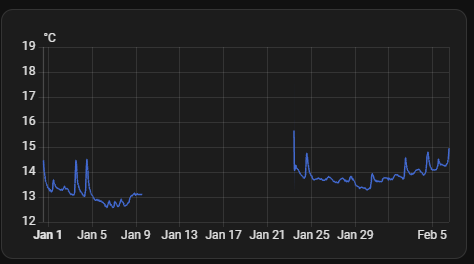
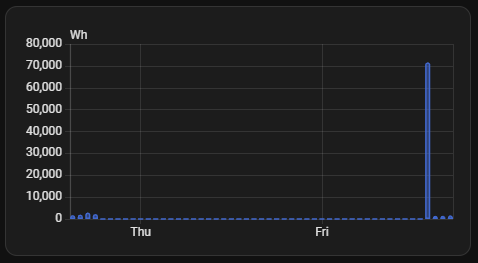
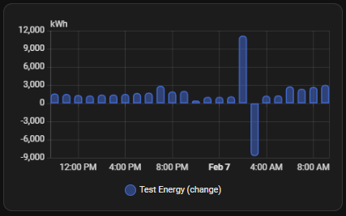

# Part 5: Find & Fix Statistics Errors

Over time, errors may appear in the statistical database for various reasons. This part describes the different types of errors, how to identify them, and methods to correct them. Understanding the error type is the first step toward fixing it.

---

**Quick jump table**

| Error Type | Detection | Fix | Auto Fix |
| --- | --- | --- | --- |
| [Missing Statistics (Data Gaps)](#51-missing-statistics) | [gap_detect](#gap_detect) | [gap_fix](#gap_fix) | ❌ |
| [Invalid Data / Spikes](#52-invalid-data--spikes) | [spike_detect](#spike_detect) | [spike_fix](#spike_fix) | ✅ manual |
| [Statistics on Deleted Entities](#53-statistics-on-deleted-entities) | [deleted_detect](#deleted_detect) | [deleted_fix](#deleted_fix) | ❌ |
| [Unit of Measurement Changed](#54-unit-of-measurement-changed) | [unit_detect](#unit_detect) | [unit_fix](#unit_fix) | ✅ manual |
| [Renamed Entities](#55-renamed-entities) | [renamed_detect](#renamed_detect) | [renamed_fix](#renamed_fix) | ✅ manual |
| [Duplicate Statistics](#56-duplicate-statistics) | [dup_detect](#dup_detect) | [dup_fix](#dup_fix) | ❌ |
| [State Class Changed](#57-state-class-changed) | [stclass_detect](#stclass_detect) | [stclass_fix](#stclass_fix) | ❌ |
| [Counter Reset Not Detected](#58-counter-reset-not-detected) | [reset_detect](#reset_detect) | [reset_fix](#reset_fix) | ❌ |
| [Wrong Mean Type](#59-wrong-mean-type-circular-vs-arithmetic) | [meantype_detect](#meantype_detect) | [meantype_fix](#meantype_fix) | ❌ |
| [Negative Values in Total_Increasing](#510-negative-values-in-total_increasing) | [neg_detect](#neg_detect) | [neg_fix](#neg_fix) | ❌ |
| [Large Unexpected Sum Jumps](#511-large-unexpected-sum-jumps) | [sumjump_detect](#sumjump_detect) | [sumjump_fix](#sumjump_fix) | ❌ |
| [Orphaned Statistics Metadata](#512-orphaned-statistics-metadata) | [orphan_detect](#orphan_detect) | [orphan_fix](#orphan_fix) | ❌ |
| [Mismatched Has_Sum and Mean_Type](#513-mismatched-has_sum-and-mean_type) | [mismatch_detect](#mismatch_detect) | [mismatch_fix](#mismatch_fix) | ❌ |

Errors can be detected by using Developer Tools, SQL queries, or monitoring logs. Some errors can be fixed automatically, others require manual intervention.
But the **best practice** is to prevent errors in the first place.

1. **Validate before deploying**
   - Test sensor configuration in developer template tool
   - Check `state_class` matches data type
   - Verify units before adding statistics

2. **Use availability templates**
   - Filter out 'unavailable' and 'unknown' states
   - Validate numeric values
   - Prevent glitch propagation

3. **Plan changes carefully**
   - Don't change units mid-stream
   - Rename entities via statistics migration tools
   - Test state_class changes on non-production data

4. **Regular monitoring**
   - Check Developer Tools → Statistics weekly
   - Review Settings → System → Repairs
   - Monitor log files for warnings

5. **Backup before modifications**
   - Always backup `home-assistant_v2.db` before direct SQL
   - Export critical statistics before migration
   - Test fixes on database copy first

---

Each error manifests differently in the UI and database. 
We are going to cover the most common errors in this document and provide information on how to fix them.

---

## **5.1 Missing Statistics**

[Description](#gap_description) | [Causes](#gap_causes) | [Manifestation](#gap_manifestation) | [Detection](#gap_detect) | [Fix](#gap_fix)

<a id="gap_description"></a><span style="font-size: 1.2em; font-weight: bold;">Description</span>  
Periods where no statistics were recorded despite the entity existing and presumably having data. This is a common issue when the integration was not running or home assistant was shutdown.

<a id="gap_causes"></a><span style="font-size: 1.2em; font-weight: bold;">Causes</span>

- Sensor/integration temporarily not delivering data (device offline, network issue)
- Home Assistant was not running
- Entity was excluded from recorder during that period
- Statistics generation was disabled (`state_class` was temporarily removed)
- Database write errors

<a id="gap_manifestation"></a><span style="font-size: 1.2em; font-weight: bold;">Manifestation</span>

**Measurement entities:**

- Visible gaps/holes in history graphs
- Flat lines where interpolation fails
- Missing data points in min/max/mean charts



**Counter entities:**

- Missing bars in bar chart (energy dashboard)
- Discontinuity in cumulative sum (A large variation crushes the values around it.)
- Appears as zero consumption for that period



<a id="gap_detect"></a><span style="font-size: 1.2em; font-weight: bold;">Detection</span>

The SQL queries differs for [measurement](#gap_detect_measurement) and [counter](#gap_detect_counter) entities.

<a id="gap_detect_measurement"></a>**Query for Measurement**

```sql
-- Check for gaps in statistics - SQLite version
-- Only shows rows with gaps (WHERE gap_seconds > 3600)
-- Shows gap size in hours for easier reading
-- Distinguishes between regular gaps (>1h) and large gaps (>2h)
-- Sorts by largest gaps first (most problematic)
WITH gap_analysis AS (
  SELECT 
    datetime(start_ts, 'unixepoch') as period,
    mean,
    start_ts,
    LAG(start_ts) OVER (ORDER BY start_ts) as previous_ts,
    start_ts - LAG(start_ts) OVER (ORDER BY start_ts) as gap_seconds
  FROM statistics
  WHERE metadata_id = (SELECT id FROM statistics_meta WHERE statistic_id = 'sensor.temperature_entree')
)
SELECT 
  period,
  mean,
  gap_seconds / 3600.0 as gap_hours,
  CASE 
    WHEN gap_seconds > 7200 THEN '⚠️ LARGE GAP (>2 hours)'
    WHEN gap_seconds > 3600 THEN '⚠️ GAP DETECTED'
  END as gap_severity
FROM gap_analysis
WHERE gap_seconds > 3600  -- Only show gaps > 1 hour
ORDER BY gap_seconds DESC  -- Show largest gaps first
LIMIT 50;
```

| period | mean | gap_hours | gap_severity |
|---|---|---|---|
|2025-09-21 23:00:00.000000 | 25.717321462847288 | 456 | ⚠️ LARGE GAP (>2 hours) |
|2025-01-14 20:00:00.000000 | 18.87051401771877 | 228 | ⚠️ LARGE GAP (>2 hours) |
|2022-12-13 20:00:00.000000 | 23.57158472033553 | 147 | ⚠️ LARGE GAP (>2 hours) |
|2022-12-14 13:00:00.000000 | 20.547605773116427 | 11 | ⚠️ LARGE GAP (>2 hours) |
|2023-12-03 08:00:00.000000 | 19.8 | 9 | ⚠️ LARGE GAP (>2 hours) |
|2022-12-25 18:00:00.000000 | 20.300000000000004 | 9 | ⚠️ LARGE GAP (>2 hours) |
|2025-01-22 19:00:00.000000 | 17.69790881333039 | 7 | ⚠️ LARGE GAP (>2 hours) |
|2023-12-03 17:00:00.000000 | 19.725162957811452 | 3 | ⚠️ LARGE GAP (>2 hours) |
|2023-09-21 16:00:00.000000 | 22.09918343405555 | 2 | ⚠️ GAP DETECTED |
|2023-02-05 10:00:00.000000 | 18.800000000000004 | 2 | ⚠️ GAP DETECTED |

<a id="gap_detect_counter"></a>**Query for Counter**

```sql
-- Check for gaps in counter statistics (only show gaps) - SQLite
WITH gap_analysis AS (
  SELECT 
    datetime(start_ts, 'unixepoch', 'localtime') as period,
    state,
    sum,
    sum - LAG(sum) OVER (ORDER BY start_ts) as consumption,
    start_ts,
    LAG(start_ts) OVER (ORDER BY start_ts) as previous_ts,
    start_ts - LAG(start_ts) OVER (ORDER BY start_ts) as gap_seconds
  FROM statistics
  WHERE metadata_id = (SELECT id FROM statistics_meta WHERE statistic_id = 'sensor.east')
)
SELECT 
  period,
  state as counter_value,
  sum as cumulative_sum,
  consumption as period_consumption,
  gap_seconds / 3600.0 as gap_hours,
  CASE 
    WHEN gap_seconds > 7200 THEN '⚠️ LARGE GAP (>2 hours)'
    WHEN gap_seconds > 3600 THEN '⚠️ GAP DETECTED'
  END as gap_severity,
  '❌ Missing consumption data for this period' as impact
FROM gap_analysis
WHERE gap_seconds > 3600  -- Only show gaps > 1 hour
ORDER BY gap_seconds DESC
LIMIT 50;
```

| period              | counter_value | cumulative_sum | period_consumption | gap_hours | gap_severity   | impact |
|---------------------|---------------|----------------|-------------------|-----------|----------------|--- |
| 2026-01-15 14:00:00 | 1250.5        | 1250.5         | NULL              | 6.0       | ⚠️ LARGE GAP  | ❌ Missing consumption data |
| 2026-01-20 06:00:00 | 1305.2        | 1305.2         | NULL              | 3.0       | ⚠️ LARGE GAP  | ❌ Missing consumption data |

```sql
-- Version Showing gaps with before/after context
-- This version shows the records before and after each gap for better context:
SELECT 
  datetime(s1.start_ts, 'unixepoch', 'localtime') as last_record_before_gap,
  s1.state as state_before,
  s1.sum as sum_before,
  '⚠️ --- GAP ---' as gap_indicator,
  ROUND((s2.start_ts - s1.start_ts) / 3600.0, 1) as gap_hours,
  datetime(s2.start_ts, 'unixepoch', 'localtime') as first_record_after_gap,
  s2.state as state_after,
  s2.sum as sum_after,
  s2.sum - s1.sum as sum_change_across_gap,
  CASE 
    WHEN s2.sum = s1.sum THEN '❌ No consumption recorded (sum unchanged)'
    WHEN s2.state < s1.state THEN '⚠️ Counter may have reset during gap'
    ELSE '⚠️ Consumption during gap unknown'
  END as gap_impact
FROM statistics s1
JOIN statistics s2 ON s2.metadata_id = s1.metadata_id 
  AND s2.start_ts = (
    SELECT MIN(start_ts) 
    FROM statistics 
    WHERE metadata_id = s1.metadata_id 
    AND start_ts > s1.start_ts
  )
WHERE s1.metadata_id = (SELECT id FROM statistics_meta WHERE statistic_id = 'sensor.east')
  AND (s2.start_ts - s1.start_ts) > 3600
ORDER BY gap_hours DESC
LIMIT 50;
```

| before_gap_ts | state_bef. | sum_bef. | gap_hour | first_record_after_gap | state_aft. | sum_aft. | sum_change | gap_impact |
|------------------------|--------------|------------|-----------|------------------------|-------------|-----------|------------|--- |
| 2026-01-15 08:00:00    | 1220.5       | 1220.5     | 6.0       | 2026-01-15 14:00:00    | 1250.5      | 1250.5    | 30.0       | ⚠️ Consumption during gap |
| 2026-01-20 03:00:00    | 1305.2       | 1305.2     | 3.0       | 2026-01-20 06:00:00    | 1305.2      | 1305.2    | 0.0        | ❌ No consumption recorded |

<a id="gap_fix"></a><span style="font-size: 1.2em; font-weight: bold;">Missing Statistics Fix</span>

TODO PLACEHOLDER

---

<a id="52-invalid-data--spikes"></a>## **5.2 Invalid Data / Spikes**

[Description](#spike_description) | [Causes](#spike_causes) | [Manifestation](#spike_manifestation) | [Detection](#spike_detect) | [Fix](#spike_fix)

<a id="spike_description"></a><span style="font-size: 1.2em; font-weight: bold;">Description</span>  
Statistics contain obviously wrong values due to sensor glitches, measurement errors, or data corruption.

<a id="spike_causes"></a><span style="font-size: 1.2em; font-weight: bold;">Causes</span>

- Sensor hardware malfunction (reading errors)
- Communication interference (corrupt packets)
- Integration bugs (incorrect parsing)
- Sensor calibration issues
- Power fluctuations affecting readings
- No validation in template sensors

<a id="spike_manifestation"></a><span style="font-size: 1.2em; font-weight: bold;">Spike Manifestation</span>

**Measurement entities:**

- Extreme outliers in min/max values
- Impossible values (e.g., -273.15°C temperature, 150% humidity)
- Single extreme spikes followed by return to normal
- Affects mean calculation for that period

```text
Temperature readings:
12:00 → mean: 21.5°C, min: 21.2°C, max: 21.8°C  [NORMAL]
13:00 → mean: 45.2°C, min: 21.5°C, max: 89.7°C  [SPIKE ERROR]
14:00 → mean: 21.8°C, min: 21.6°C, max: 22.0°C  [BACK TO NORMAL]
```

**Counter entities:**

- Massive positive spike followed by negative spike (or vice versa)
- Sum jumps unrealistically high then drops back
- Can trigger false counter reset detection
- Creates artificial consumption peaks in energy dashboard



<a id="spike_detect"></a><span style="font-size: 1.2em; font-weight: bold;">Spike Detection</span>

The SQL queries differs for [measurement](#spike_detect_measurement) and [counter](#spike_detect_counter) entities.

<a id="spike_detect_measurement"></a><span style="font-size: 1.2em; font-weight: bold;">Spike Detection for Measurement</span>

```sql
-- Find outliers (values > 3 standard deviations from mean)
WITH stats AS (
  SELECT 
    AVG(mean) as avg_mean,
    AVG(mean * mean) - AVG(mean) * AVG(mean) as variance
  FROM statistics
  WHERE metadata_id = (SELECT id FROM statistics_meta WHERE statistic_id = 'sensor.temperature')
)
SELECT 
  datetime(start_ts, 'unixepoch', 'localtime') as period,
  mean,
  min,
  max,
  CASE 
    WHEN ABS(mean - (SELECT avg_mean FROM stats)) > 3 * SQRT((SELECT variance FROM stats))
    THEN '⚠️ OUTLIER'
    ELSE 'OK'
  END as outlier_check
FROM statistics
WHERE metadata_id = (SELECT id FROM statistics_meta WHERE statistic_id = 'sensor.temperature')
ORDER BY start_ts DESC;
```

<a id="spike_detect_counter"></a><span style="font-size: 1.2em; font-weight: bold;">Spike Detection for Counter</span>

```sql
-- Find invalid spikes in counter statistics - SQLite
WITH counter_analysis AS (
  SELECT 
    datetime(start_ts, 'unixepoch', 'localtime') as period,
    state,
    sum,
    LAG(state) OVER (ORDER BY start_ts) as previous_state,
    LAG(sum) OVER (ORDER BY start_ts) as previous_sum,
    state - LAG(state) OVER (ORDER BY start_ts) as state_change,
    sum - LAG(sum) OVER (ORDER BY start_ts) as consumption,
    -- Calculate average consumption over last 24 periods
    AVG(sum - LAG(sum) OVER (ORDER BY start_ts)) OVER (
      ROWS BETWEEN 24 PRECEDING AND 1 PRECEDING
    ) as avg_24h_consumption,
    -- Calculate standard deviation
    (sum - LAG(sum) OVER (ORDER BY start_ts)) as hourly_consumption
  FROM statistics
  WHERE metadata_id = (SELECT id FROM statistics_meta WHERE statistic_id = 'sensor.energy_total')
)
SELECT 
  period,
  state as counter_value,
  sum as cumulative_sum,
  consumption as hourly_consumption,
  ROUND(avg_24h_consumption, 2) as avg_24h,
  ROUND(consumption / NULLIF(avg_24h_consumption, 0), 1) as spike_multiplier,
  CASE 
    WHEN consumption IS NULL THEN 'First record'
    WHEN avg_24h_consumption = 0 THEN '⚠️ No baseline yet'
    WHEN consumption < 0 THEN '❌ NEGATIVE consumption (impossible!)'
    WHEN consumption > avg_24h_consumption * 10 THEN '❌ EXTREME SPIKE (>10x normal)'
    WHEN consumption > avg_24h_consumption * 5 THEN '⚠️ LARGE SPIKE (>5x normal)'
    WHEN consumption > avg_24h_consumption * 3 THEN '⚠️ SPIKE DETECTED (>3x normal)'
    WHEN ABS(state_change) < 0.001 AND consumption > 0 THEN '⚠️ Sum increased but state unchanged'
    ELSE 'OK'
  END as spike_status,
  CASE 
    WHEN consumption < 0 THEN 'Counter decreased (hardware error or missed reset)'
    WHEN consumption > avg_24h_consumption * 10 THEN 'Unrealistic consumption spike'
    WHEN ABS(state_change) < 0.001 AND consumption > 0 THEN 'Sum/state mismatch'
    ELSE ''
  END as issue_description
FROM counter_analysis
WHERE consumption IS NOT NULL
  AND avg_24h_consumption > 0
  AND (
    consumption < 0 
    OR consumption > avg_24h_consumption * 3
    OR (ABS(state_change) < 0.001 AND consumption > 0)
  )
ORDER BY ABS(consumption / NULLIF(avg_24h_consumption, 1)) DESC
LIMIT 50;
```

| period              | counter_value | cumulative_sum | hourly_consumption | avg_24h | spike_multiplier | spike_status              | issue_description |
|---------------------|---------------|----------------|-------------------|---------|------------------|---------------------------|-------------------|
| 2026-01-15 13:00:00 | 1255.2        | 1255.2         | 2500.0            | 2.5     | 1000.0           | ❌ EXTREME SPIKE (>10x)  | Unrealistic consumption spike  |
| 2026-01-20 08:00:00 | 1305.8        | 1305.8         | -45.2             | 2.3     | -19.7            | ❌ NEGATIVE consumption  | Counter decreased |
| 2026-02-01 14:00:00 | 1450.0        | 1450.0         | 18.5              | 2.4     | 7.7              | ⚠️ LARGE SPIKE (>5x)    | |

```sql
-- Detect spike + recovery pattern (glitch signature) - SQLite (corrected)
WITH consumption_calc AS (
  -- Step 1: Calculate consumption and next consumption
  SELECT 
    datetime(start_ts, 'unixepoch', 'localtime') as period,
    start_ts,
    state,
    sum,
    sum - LAG(sum) OVER (ORDER BY start_ts) as consumption,
    LEAD(sum) OVER (ORDER BY start_ts) - sum as next_consumption
  FROM statistics
  WHERE metadata_id = (SELECT id FROM statistics_meta WHERE statistic_id = 'sensor.energy_total')
),
consumption_with_avg AS (
  -- Step 2: Calculate rolling average
  SELECT 
    period,
    state,
    sum,
    consumption,
    next_consumption,
    AVG(consumption) OVER (
      ORDER BY start_ts
      ROWS BETWEEN 24 PRECEDING AND 1 PRECEDING
    ) as avg_consumption
  FROM consumption_calc
)
SELECT 
  period,
  state,
  sum,
  ROUND(consumption, 2) as this_period_consumption,
  ROUND(next_consumption, 2) as next_period_consumption,
  ROUND(avg_consumption, 2) as baseline_avg,
  CASE 
    WHEN consumption > avg_consumption * 5 
         AND next_consumption < 0 
         AND ABS(next_consumption) > avg_consumption * 3
    THEN '❌ SPIKE + DROP GLITCH DETECTED'
    WHEN consumption > avg_consumption * 5 
         AND next_consumption < avg_consumption * 0.2
    THEN '⚠️ SPIKE followed by very low consumption'
    WHEN consumption < 0 
         AND next_consumption > avg_consumption * 3
    THEN '⚠️ DROP followed by spike (inverse glitch)'
    ELSE 'Potential issue'
  END as glitch_pattern,
  'Data integrity compromised - manual correction may be needed' as recommendation
FROM consumption_with_avg
WHERE avg_consumption > 0
  AND (
    -- Spike followed by negative consumption
    (consumption > avg_consumption * 5 AND next_consumption < 0) OR
    -- Negative consumption followed by spike
    (consumption < 0 AND next_consumption > avg_consumption * 3) OR
    -- Extreme spike followed by near-zero
    (consumption > avg_consumption * 10 AND next_consumption < avg_consumption * 0.2)
  )
ORDER BY period DESC
LIMIT 50;
```

| period              | state  | sum    | this_period | next_period | baseline_avg | glitch_pattern                | recommendation |
|---------------------|--------|--------|-------------|-------------|--------------|-------------------------------|----------------|
| 2026-01-15 13:00:00 | 1255.2 | 1255.2 | 2500.00     | -2480.00    | 2.50         | ❌ SPIKE + DROP GLITCH      | Manual correction needed |
| 2026-02-03 09:00:00 | 1580.5 | 1580.5 | 125.50      | 0.10        | 2.80         | ⚠️ SPIKE + very low         | Manual correction needed |

<a id="spike_fix"></a><span style="font-size: 1.2em; font-weight: bold;">Spike Fix</span>

TODO PLACEHOLDER

---

## **5.3 Statistics on Deleted Entities**

[Description](#deleted_description) | [Causes](#deleted_causes) | [Manifestation](#deleted_manifestation) | [Detection](#deleted_detect) | [Fix](#deleted_fix)

<a id="deleted_description"></a><span style="font-size: 1.2em; font-weight: bold;">Description</span>  
Statistics remain in the database for entities that no longer exist in Home Assistant.

<a id="deleted_causes"></a><span style="font-size: 1.2em; font-weight: bold;">Causes</span>

- Entity was deleted or removed from configuration
- Integration was uninstalled
- Device was removed
- Entity ID was changed without migration
- Statistics were not purged when entity was deleted

<a id="deleted_manifestation"></a><span style="font-size: 1.2em; font-weight: bold;">Deleted Entities Manifestation</span>

- Statistics shown in Developer Tools → Statistics for non-existent entities
- Orphaned `statistic_id` entries in `statistics_meta`
- Wasted database space
- Confusing in energy dashboard or history graphs
- Entity appears in statistics but not in entity list

**Example:**

statistics_meta table:

| statistic_id                  | source   | unit | has_sum | |
|-------------------------------|----------|------|---------| |
| sensor.old_temperature        | recorder | °C   | 0       | ← Entity deleted |
| sensor.removed_power_meter    | recorder | W    | 0       | ← Integration removed |
| sensor.current_temperature    | recorder | °C   | 0       | ← Still exists |

<a id="deleted_detect"></a><span style="font-size: 1.2em; font-weight: bold;">Detection</span>

```sql
-- Find statistics for entities that no longer exist in Home Assistant
-- indicates number of records attached to the deleted entity
SELECT sm.id as stats_meta_id, 
       sm.statistic_id, 
       sm.source, 
       sm.unit_of_measurement,
       COUNT(s.id) as record_count,
       MIN(datetime(s.start_ts, 'unixepoch')) as first_record,
       MAX(datetime(s.start_ts, 'unixepoch')) as last_record
FROM statistics_meta sm
LEFT JOIN states_meta stm ON sm.statistic_id = stm.entity_id
LEFT JOIN statistics s ON sm.id = s.metadata_id
WHERE stm.entity_id IS NULL
GROUP BY sm.id, sm.statistic_id, sm.source, sm.unit_of_measurement
ORDER BY sm.statistic_id;
```

| statistic_id           | record_count | Issue |
|------------------------|--------------|-------|
| sensor.old_temperature | 8760         | ← Has lots of data |
| sensor.failed_sensor   | 0            | ← Never generated data |

<a id="deleted_fix"></a><span style="font-size: 1.2em; font-weight: bold;">Deleted Entities Fix</span>

TODO PLACEHOLDER

---

## **5.x Orphan Entities** TODO bump number below

<a id="orphan_description"></a><span style="font-size: 1.2em; font-weight: bold;">Description</span>  
Orphaned entities are entities that are no longer claimed by an integration. This can happen when an integration is removed or when an integration is no longer working. Home Assistant considers an entity only orphaned if it has been unclaimed since the last restart of Home Assistant.

TODO ...

<a id="orphan_detect"></a><span style="font-size: 1.2em; font-weight: bold;">Detection</span>

TODO REWRITE properly: Seems like at restart HA has a way to detect orphan (?). Based on this information it updates the states table by setting it to NULL. Therefore the way to detect orphan it to see entities with NULL state. The following query is performance optimized :)

```sql
SELECT stm.entity_id,
       st.state,
       datetime(st.last_updated_ts, 'unixepoch') as last_updated,
       sm.statistic_id,
       COUNT(s.id) as statistics_count
FROM states_meta stm
JOIN states st ON stm.metadata_id = st.metadata_id
LEFT JOIN statistics_meta sm ON stm.entity_id = sm.statistic_id
LEFT JOIN statistics s ON sm.id = s.metadata_id
WHERE st.state IS NULL
  AND st.state_id = (SELECT state_id FROM states WHERE metadata_id = stm.metadata_id ORDER BY last_updated_ts DESC LIMIT 1)
GROUP BY stm.entity_id, st.state, st.last_updated_ts, sm.statistic_id
ORDER BY st.last_updated_ts DESC;
```

## **5.4 Unit of Measurement Changed**

[Description](#unit_description) | [Causes](#unit_causes) | [Manifestation](#unit_manifestation) | [Detection](#unit_detect) | [Fix](#unit_fix)

<a id="unit_description"></a><span style="font-size: 1.2em; font-weight: bold;">Description</span>  
The sensor's unit of measurement changed, creating a new statistics series and discontinuity in data.

<a id="unit_causes"></a><span style="font-size: 1.2em; font-weight: bold;">Causes</span>

- Sensor configuration was changed (e.g., Wh → kWh)
- Integration updated with different default units
- Manual reconfiguration
- Device firmware change
- Template sensor modified

<a id="unit_manifestation"></a><span style="font-size: 1.2em; font-weight: bold;">Unit Changed Manifestation</span>

- Two separate entries in `statistics_meta` for what should be one sensor
- Different `statistic_id` entries (often with suffix like `_2`, `_3`)
- Graphs show discontinuity at the change point
- Energy dashboard may not recognize the new series
- Historical data appears "lost" (actually in different series)

**Example:**

statistics_meta table:

| id | statistic_id              | unit_of_measurement | has_sum | source |
|----|---------------------------|---------------------|---------|--------|
| 42 | sensor.power_consumption  | Wh                  | 1       | recorder ← Old (stopped 2025-12-01) |
| 89 | sensor.power_consumption  | kWh                 | 1       | recorder ← New (started 2025-12-01) |

**Visual effect:**

```text
Energy graph shows:
Jan-Nov 2025: [███████████████] 15000 Wh total
Dec 2025-Jan 2026: [No data shown] ← Actually exists but in different series
```

<a id="unit_detect"></a><span style="font-size: 1.2em; font-weight: bold;">Unit Changed Detection</span>

```sql
-- Find duplicate statistic_id with different units
SELECT 
  statistic_id,
  unit_of_measurement,
  COUNT(*) as series_count,
  GROUP_CONCAT(id) as metadata_ids
FROM statistics_meta
GROUP BY statistic_id
HAVING COUNT(*) > 1
ORDER BY statistic_id;
```

<a id="unit_fix"></a><span style="font-size: 1.2em; font-weight: bold;">Unit Changed Fix</span>

TODO PLACEHOLDER

---

## **5.5 Renamed Entities**

[Description](#renamed_description) | [Causes](#renamed_causes) | [Manifestation](#renamed_manifestation) | [Detection](#renamed_detect) | [Fix](#renamed_fix)

<a id="renamed_description"></a><span style="font-size: 1.2em; font-weight: bold;">Description</span>  
Entity was renamed, but statistics remain under the old `entity_id`, causing apparent data loss.

<a id="renamed_causes"></a><span style="font-size: 1.2em; font-weight: bold;">Causes</span>

- Entity renamed via UI (Settings → Entities)
- Entity ID changed in configuration.yaml
- Integration reorganized entity IDs
- Device renamed causing entity_id change

<a id="renamed_manifestation"></a><span style="font-size: 1.2em; font-weight: bold;">Renamed Entities Manifestation</span>

- Statistics exist for old entity_id but not new one
- Historical data appears "missing" for renamed entity
- Two entries appear: one with history (old name), one without (new name)
- Energy dashboard loses tracking continuity
- Automations referencing old statistics fail

**Example:**

Old: sensor.living_room_temperature
New: sensor.lounge_temperature

statistics_meta shows:

| statistic_id                     | Last record       | |
|----------------------------------|-------------------|---|
| sensor.living_room_temperature   | 2025-12-15        | ← All history here |
| sensor.lounge_temperature        | 2025-12-16 →      | ← New data here |

<a id="renamed_detect"></a><span style="font-size: 1.2em; font-weight: bold;">Renamed Entities Detection</span>

```sql
-- Find statistics that might be renamed (similar names, one stopped, one started)
SELECT 
  sm1.statistic_id as old_name,
  MAX(s1.start_ts) as old_last_record,
  sm2.statistic_id as possibly_new_name,
  MIN(s2.start_ts) as new_first_record,
  ABS(MAX(s1.start_ts) - MIN(s2.start_ts)) as time_gap_seconds
FROM statistics_meta sm1
JOIN statistics s1 ON sm1.id = s1.metadata_id
JOIN statistics_meta sm2 ON sm1.unit_of_measurement = sm2.unit_of_measurement
  AND sm1.has_sum = sm2.has_sum
  AND sm1.statistic_id != sm2.statistic_id
JOIN statistics s2 ON sm2.id = s2.metadata_id
WHERE time_gap_seconds < 86400  -- Within 24 hours
GROUP BY sm1.statistic_id, sm2.statistic_id
ORDER BY time_gap_seconds;
```

<a id="renamed_fix"></a><span style="font-size: 1.2em; font-weight: bold;">Renamed Entities Fix</span>

TODO PLACEHOLDER

---

## **5.6 Duplicate Statistics**

[Description](#dup_description) | [Causes](#dup_causes) | [Manifestation](#dup_manifestation) | [Detection](#dup_detect) | [Fix](#dup_fix)

<a id="dup_description"></a><span style="font-size: 1.2em; font-weight: bold;">Description</span>  
Multiple statistics records exist for the same entity and time period, causing data integrity issues.

<a id="dup_causes"></a><span style="font-size: 1.2em; font-weight: bold;">Causes</span>

- Database corruption
- Import errors when migrating databases
- Manual SQL modifications gone wrong
- Statistics repair tool malfunction
- Concurrent write conflicts

<a id="dup_manifestation"></a><span style="font-size: 1.2em; font-weight: bold;">Duplicate Statistics Manifestation</span>

- Multiple records with identical `metadata_id` and `start_ts`
- Inconsistent values shown in different UI views
- Errors in Developer Tools → Statistics validation
- Warnings in Home Assistant logs
- Incorrect aggregations in long-term statistics

**Example:**

```sql
SELECT * FROM statistics 
WHERE metadata_id = 42 AND start_ts = 1735660800;
```

| id    | metadata_id | start_ts   | mean  | sum   | notes |
|-------|-------------|------------|-------|-------|-------|
| 10001 | 42          | 1735660800 | 23.5  | NULL  | ← Duplicate! |
| 10023 | 42          | 1735660800 | 23.7  | NULL  | ← Duplicate! |

<a id="dup_detect"></a><span style="font-size: 1.2em; font-weight: bold;">Duplicate Statistics Detection</span>

```sql
-- Find duplicate statistics
SELECT 
  metadata_id,
  start_ts,
  datetime(start_ts, 'unixepoch', 'localtime') as period,
  COUNT(*) as duplicate_count,
  GROUP_CONCAT(id) as record_ids
FROM statistics
GROUP BY metadata_id, start_ts
HAVING COUNT(*) > 1
ORDER BY start_ts DESC;
```

<a id="dup_fix"></a><span style="font-size: 1.2em; font-weight: bold;">Duplicate Statistics Fix</span>

TODO PLACEHOLDER

---

## **5.7 State Class Changed**

[Description](#stclass_description) | [Causes](#stclass_causes) | [Manifestation](#stclass_manifestation) | [Detection](#stclass_detect) | [Fix](#stclass_fix)

<a id="stclass_description"></a><span style="font-size: 1.2em; font-weight: bold;">Description</span>  
The `state_class` attribute was changed (e.g., `measurement` → `total_increasing`), creating incompatible statistics.

<a id="stclass_causes"></a><span style="font-size: 1.2em; font-weight: bold;">Causes</span>

- Configuration error or experimentation
- Integration update changed default state class
- User misunderstanding of state_class purpose
- Template sensor reconfiguration

<a id="stclass_manifestation"></a><span style="font-size: 1.2em; font-weight: bold;">State Class Changed Manifestation</span>

- New `statistic_id` may be created with suffix
- Existing statistics may show validation warnings
- Incorrect statistics type for entity behavior
- Energy dashboard may reject the sensor
- Graphs show wrong visualization type

**Example:**

```text
Before: state_class: measurement  → tracks mean/min/max
After:  state_class: total_increasing → tracks sum

Result:
- Old statistics show mean values (e.g., 2.5 kW)
- New statistics show sum values (e.g., 150 kWh)
- Incompatible for merging or comparison
```

<a id="stclass_detect"></a><span style="font-size: 1.2em; font-weight: bold;">State Class Changed Detection</span>

```sql
-- Detect potential state_class changes
-- (Look for metadata_id with both has_sum=0 and has_sum=1 for similar statistic_id)
SELECT 
  sm1.statistic_id,
  sm1.has_sum as type1_has_sum,
  sm1.mean_type as type1_mean_type,
  sm2.statistic_id as similar_id,
  sm2.has_sum as type2_has_sum,
  sm2.mean_type as type2_mean_type
FROM statistics_meta sm1
JOIN statistics_meta sm2 
  ON sm1.statistic_id LIKE sm2.statistic_id || '%'
  OR sm2.statistic_id LIKE sm1.statistic_id || '%'
WHERE sm1.has_sum != sm2.has_sum
  AND sm1.id != sm2.id;
```

<a id="stclass_fix"></a><span style="font-size: 1.2em; font-weight: bold;">State Class Changed Fix</span>

TODO PLACEHOLDER

---

## **5.8 Counter Reset Not Detected**

[Description](#reset_description) | [Causes](#reset_causes) | [Manifestation](#reset_manifestation) | [Detection](#reset_detect) | [Fix](#reset_fix)

<a id="reset_description"></a><span style="font-size: 1.2em; font-weight: bold;">Description</span>  
A `total_increasing` counter reset to zero, but the statistics system didn't detect it, resulting in negative or missing consumption data.

<a id="reset_causes"></a><span style="font-size: 1.2em; font-weight: bold;">Causes</span>

- Reset was too small (< 10% threshold)
- Counter decremented instead of resetting (hardware issue)
- Statistics compiler wasn't running during reset
- Database wasn't updated with `last_reset` timestamp
- Sensor temporarily reported unavailable during reset

<a id="reset_manifestation"></a><span style="font-size: 1.2em; font-weight: bold;">Counter Reset Manifestation</span>

- Negative hourly consumption values in energy dashboard
- Sum stops increasing or shows incorrect totals
- Bar chart shows no consumption when there should be
- State value is lower than previous, but sum didn't adjust

**Example:**

```text
Counter readings:
10:00 → state: 1250 kWh, sum: 1250 kWh
11:00 → state: 1255 kWh, sum: 1255 kWh (+5 kWh consumption) ✓
12:00 → state: 5 kWh,    sum: 1255 kWh (reset not detected!)
13:00 → state: 8 kWh,    sum: 1258 kWh (+3 kWh consumption) ✓

Expected at 12:00: sum should handle reset gracefully
Actual: sum froze, hourly consumption = 0
```

<a id="reset_detect"></a><span style="font-size: 1.2em; font-weight: bold;">Counter Reset Detection</span>

```sql
-- Find potential missed resets
SELECT 
  datetime(start_ts, 'unixepoch', 'localtime') as period,
  state,
  LAG(state) OVER (ORDER BY start_ts) as previous_state,
  sum,
  LAG(sum) OVER (ORDER BY start_ts) as previous_sum,
  CASE 
    WHEN state < LAG(state) OVER (ORDER BY start_ts) * 0.9 
         AND sum = LAG(sum) OVER (ORDER BY start_ts)
    THEN '⚠️ MISSED RESET'
    ELSE 'OK'
  END as reset_check
FROM statistics
WHERE metadata_id = (SELECT id FROM statistics_meta WHERE statistic_id = 'sensor.energy_total')
ORDER BY start_ts DESC
LIMIT 50;
```

<a id="reset_fix"></a><span style="font-size: 1.2em; font-weight: bold;">Counter Reset Fix</span>

TODO PLACEHOLDER

---

## **5.9 Wrong Mean Type (Circular vs Arithmetic)**

[Description](#meantype_description) | [Causes](#meantype_causes) | [Manifestation](#meantype_manifestation) | [Detection](#meantype_detect) | [Fix](#meantype_fix)

<a id="meantype_description"></a><span style="font-size: 1.2em; font-weight: bold;">Description</span>  
Non-angular data is being processed with circular mean, or angular data with arithmetic mean.

<a id="meantype_causes"></a><span style="font-size: 1.2em; font-weight: bold;">Causes</span>

- Incorrect `device_class` configuration
- Template sensor without proper device_class
- Integration bug assigning wrong device_class
- Manual database modification error

<a id="meantype_manifestation"></a><span style="font-size: 1.2em; font-weight: bold;">Wrong Mean Type Manifestation</span>

- Angular sensors show impossible mean values
  - Wind direction mean of 520° (should be 0-360°)
  - Compass heading with negative values
- Non-angular sensors averaged incorrectly
  - Temperature treated as circular (rare but possible configuration error)

**Example:**

```text
Wind Direction Sensor with mean_type=1 (arithmetic) - WRONG:
0° + 350° + 340° = 690° / 3 = 230°  ← WRONG! (should be ~350°)

Wind Direction Sensor with mean_type=2 (circular) - CORRECT:
0° + 350° + 340° → vectors → 350°  ← CORRECT!
```

<a id="meantype_detect"></a><span style="font-size: 1.2em; font-weight: bold;">Wrong Mean Type Detection</span>

```sql
-- Check mean_type matches device_class expectations
SELECT 
  sm.statistic_id,
  sm.mean_type,
  CASE sm.mean_type
    WHEN 0 THEN 'None'
    WHEN 1 THEN 'Arithmetic'
    WHEN 2 THEN 'Circular'
  END as mean_type_name,
  -- Check if statistic_id suggests angular data
  CASE 
    WHEN (sm.statistic_id LIKE '%direction%' 
          OR sm.statistic_id LIKE '%bearing%'
          OR sm.statistic_id LIKE '%heading%'
          OR sm.statistic_id LIKE '%azimuth%')
         AND sm.mean_type != 2 
    THEN '⚠️ Should be circular'
    WHEN sm.mean_type = 2 
         AND sm.statistic_id NOT LIKE '%direction%'
         AND sm.statistic_id NOT LIKE '%bearing%'
    THEN '⚠️ Should NOT be circular'
    ELSE 'OK'
  END as validation
FROM statistics_meta sm
WHERE sm.mean_type IN (1, 2);
```

<a id="meantype_fix"></a><span style="font-size: 1.2em; font-weight: bold;">Wrong Mean Type Fix</span>

TODO PLACEHOLDER

---

## **5.10 Negative Values in Total_Increasing**

[Description](#neg_description) | [Causes](#neg_causes) | [Manifestation](#neg_manifestation) | [Detection](#neg_detect) | [Fix](#neg_fix)

<a id="neg_description"></a><span style="font-size: 1.2em; font-weight: bold;">Description</span>  
A `total_increasing` counter shows negative state or sum values, which violates the monotonic increase constraint.

<a id="neg_causes"></a><span style="font-size: 1.2em; font-weight: bold;">Causes</span>

- Sensor returned negative value due to hardware error
- Template calculation error (e.g., subtraction instead of addition)
- Database corruption
- Manual statistics injection error
- Counter rollover with incorrect handling

<a id="neg_manifestation"></a><span style="font-size: 1.2em; font-weight: bold;">Negative Values Manifestation</span>

- Validation errors in Developer Tools → Statistics
- Energy dashboard shows negative consumption
- Bar charts with negative bars
- Warning messages in Home Assistant logs
- Impossible physical values (negative total energy consumed)

**Example:**

statistics table:

| start_ts   | state  | sum    | Issue                    |
|------------|--------|--------|--------------------------|
| 1735574400 | 1250.5 | 1250.5 | OK                       |
| 1735578000 | -5.2   | 1245.3 | ⚠️ Negative state value! |
| 1735581600 | 8.7    | 1254.0 | Recovered                |

<a id="neg_detect"></a><span style="font-size: 1.2em; font-weight: bold;">Negative Values Detection</span>

```sql
-- Find negative values in total_increasing sensors
SELECT 
  sm.statistic_id,
  datetime(s.start_ts, 'unixepoch', 'localtime') as period,
  s.state,
  s.sum,
  '⚠️ NEGATIVE VALUE' as issue
FROM statistics s
JOIN statistics_meta sm ON s.metadata_id = sm.id
WHERE sm.has_sum = 1  -- Counter type
  AND (s.state < 0 OR s.sum < 0)
ORDER BY s.start_ts DESC;
```

<a id="neg_fix"></a><span style="font-size: 1.2em; font-weight: bold;">Negative Values Fix</span>

TODO PLACEHOLDER

---

## **5.11 Large Unexpected Sum Jumps**

[Description](#sumjump_description) | [Causes](#sumjump_causes) | [Manifestation](#sumjump_manifestation) | [Detection](#sumjump_detect) | [Fix](#sumjump_fix)

<a id="sumjump_description"></a><span style="font-size: 1.2em; font-weight: bold;">Description</span>  
The `sum` field shows unrealistic jumps between periods that don't match the `state` values or expected consumption patterns.

<a id="sumjump_causes"></a><span style="font-size: 1.2em; font-weight: bold;">Causes</span>

- Integration bug calculating sum incorrectly
- Counter reset handled incorrectly (added instead of continuing)
- Manual statistics import error
- Data corruption during database migration
- Sensor sent burst of accumulated data

<a id="sumjump_manifestation"></a><span style="font-size: 1.2em; font-weight: bold;">Sum Jumps Manifestation</span>

- Energy dashboard shows impossible consumption spikes
- Single hour shows years worth of consumption
- Sum increases by 1000x normal amount
- May appear as single tall bar in bar chart
- Following periods return to normal rates

**Example:**

```text
Hourly consumption pattern:
10:00-11:00 → +2.5 kWh  [NORMAL]
11:00-12:00 → +2.8 kWh  [NORMAL]
12:00-13:00 → +2500 kWh [ERROR! - Should be ~2.5 kWh]
13:00-14:00 → +2.6 kWh  [NORMAL]
```

<a id="sumjump_detect"></a><span style="font-size: 1.2em; font-weight: bold;">Sum Jumps Detection</span>

```sql
-- Find abnormal sum increases (>10x average)
WITH consumption AS (
  SELECT 
    metadata_id,
    start_ts,
    sum,
    sum - LAG(sum) OVER (ORDER BY start_ts) as hourly_consumption,
    AVG(sum - LAG(sum) OVER (ORDER BY start_ts)) OVER (
      ROWS BETWEEN 24 PRECEDING AND 1 PRECEDING
    ) as avg_24h_consumption
  FROM statistics
  WHERE metadata_id = (SELECT id FROM statistics_meta WHERE statistic_id = 'sensor.energy_total')
)
SELECT 
  datetime(start_ts, 'unixepoch', 'localtime') as period,
  hourly_consumption,
  avg_24h_consumption,
  ROUND(hourly_consumption / avg_24h_consumption, 1) as multiplier,
  CASE 
    WHEN hourly_consumption > avg_24h_consumption * 10 
    THEN '⚠️ ABNORMAL SPIKE'
    ELSE 'OK'
  END as status
FROM consumption
WHERE hourly_consumption IS NOT NULL
  AND avg_24h_consumption > 0
ORDER BY start_ts DESC
LIMIT 100;
```

<a id="sumjump_fix"></a><span style="font-size: 1.2em; font-weight: bold;">Sum Jumps Fix</span>

TODO PLACEHOLDER

---

## **5.12 Orphaned Statistics Metadata**

[Description](#orphan_description) | [Causes](#orphan_causes) | [Manifestation](#orphan_manifestation) | [Detection](#orphan_detect) | [Fix](#orphan_fix)

<a id="orphan_description"></a><span style="font-size: 1.2em; font-weight: bold;">Description</span>  
Entries in `statistics_meta` table have no corresponding records in `statistics` or `statistics_short_term` tables.

<a id="orphan_causes"></a><span style="font-size: 1.2em; font-weight: bold;">Causes</span>

- Statistics were manually deleted but metadata wasn't
- Purge operation incomplete or interrupted
- Entity created but never generated statistics
- Database cleanup tools only cleaned data tables
- Statistics generation started but immediately failed

<a id="orphan_manifestation"></a><span style="font-size: 1.2em; font-weight: bold;">Orphaned Metadata Manifestation</span>

- Metadata entries with zero statistics records
- Wasted database space (minimal but clutters queries)
- Confusion when querying metadata
- Gaps between expected and actual statistics count

**Example:**

statistics_meta entry exists:

| id | statistic_id              | unit | has_sum |
|----|---------------------------|------|---------|
| 99 | sensor.phantom_sensor     | kWh  | 1       |

But querying statistics:

```sql
SELECT COUNT(*) FROM statistics WHERE metadata_id = 99;
Result: 0  ← No statistics ever recorded!
```

<a id="orphan_detect"></a><span style="font-size: 1.2em; font-weight: bold;">Orphaned Metadata Detection</span>

```sql
-- Find orphaned metadata
SELECT 
  sm.id,
  sm.statistic_id,
  sm.source,
  sm.unit_of_measurement,
  COALESCE(s_count.count, 0) as long_term_count,
  COALESCE(ss_count.count, 0) as short_term_count,
  CASE 
    WHEN COALESCE(s_count.count, 0) = 0 
         AND COALESCE(ss_count.count, 0) = 0 
    THEN '⚠️ ORPHANED'
    ELSE 'OK'
  END as status
FROM statistics_meta sm
LEFT JOIN (
  SELECT metadata_id, COUNT(*) as count 
  FROM statistics 
  GROUP BY metadata_id
) s_count ON sm.id = s_count.metadata_id
LEFT JOIN (
  SELECT metadata_id, COUNT(*) as count 
  FROM statistics_short_term 
  GROUP BY metadata_id
) ss_count ON sm.id = ss_count.metadata_id
WHERE COALESCE(s_count.count, 0) = 0 
  AND COALESCE(ss_count.count, 0) = 0;
```

<a id="orphan_fix"></a><span style="font-size: 1.2em; font-weight: bold;">Orphaned Metadata Fix</span>

TODO PLACEHOLDER

---

## **5.13 Mismatched Has_Sum and Mean_Type**

[Description](#mismatch_description) | [Causes](#mismatch_causes) | [Manifestation](#mismatch_manifestation) | [Detection](#mismatch_detect) | [Fix](#mismatch_fix)

<a id="mismatch_description"></a><span style="font-size: 1.2em; font-weight: bold;">Description</span>  
The `has_sum` and `mean_type` fields in `statistics_meta` have invalid combinations that violate statistics logic.

<a id="mismatch_causes"></a><span style="font-size: 1.2em; font-weight: bold;">Causes</span>

- Database corruption
- Manual SQL modification error
- Statistics repair tool bug
- Migration error from older HA versions

<a id="mismatch_manifestation"></a><span style="font-size: 1.2em; font-weight: bold;">Mismatched Fields Manifestation</span>

- Validation errors in Developer Tools
- Statistics compiler may skip these entities
- Queries return unexpected results
- Possible crashes in statistics-related UI

**Valid combinations:**

```text
has_sum=0, mean_type=1  → Measurement (arithmetic)
has_sum=0, mean_type=2  → Measurement (circular)
has_sum=1, mean_type=0  → Counter (no mean)
```

**Invalid combinations:**

```text
has_sum=1, mean_type=1  ❌ Counter shouldn't have mean
has_sum=1, mean_type=2  ❌ Counter shouldn't have circular mean
has_sum=0, mean_type=0  ❌ Measurement should have mean type
```

<a id="mismatch_detect"></a><span style="font-size: 1.2em; font-weight: bold;">Mismatched Fields Detection</span>

```sql
-- Find invalid has_sum / mean_type combinations
SELECT 
  statistic_id,
  has_sum,
  mean_type,
  CASE 
    WHEN has_sum = 1 AND mean_type != 0 
    THEN '❌ Counter should have mean_type=0'
    WHEN has_sum = 0 AND mean_type = 0 
    THEN '❌ Measurement should have mean_type=1 or 2'
    WHEN has_sum = 0 AND mean_type NOT IN (1, 2)
    THEN '❌ Invalid mean_type value'
    ELSE '✓ Valid'
  END as validation
FROM statistics_meta
WHERE NOT (
  (has_sum = 0 AND mean_type IN (1, 2)) OR
  (has_sum = 1 AND mean_type = 0)
);
```

<a id="mismatch_fix"></a><span style="font-size: 1.2em; font-weight: bold;">Mismatched Fields Fix</span>

TODO PLACEHOLDER

---

**Previous** - [Part 4: Best Practices and Troubleshooting](part4_practices_troubleshooting.md)

